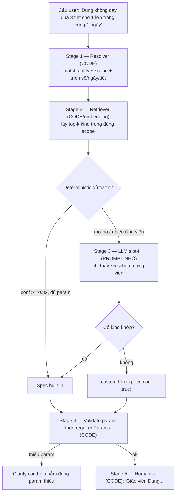
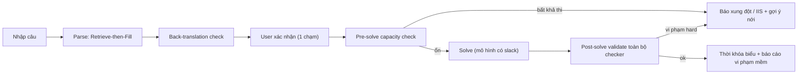

<aside>
🎯

**Mục tiêu:** Thiết kế lại tầng parse/clarify ràng buộc để (1) LLM **không phải load mega system prompt**, (2) **giảm parse lỗi** bằng kiến trúc *Retrieve-then-Fill*, (3) đảm bảo **deterministic** ở khâu trích param và hiển thị GUI. Bước cuối chỉ còn chạy `runDeterministicSolver` với specs đã chuẩn hóa.

</aside>

## 1. Bối cảnh & vấn đề hiện tại

Luồng chat hiện tại dùng một `buildSystemPrompt` khổng lồ: nhồi *toàn bộ* ~80 built-in kind, toàn bộ context, 8 nhóm quy tắc và output schema vào **một** prompt, rồi bắt LLM **đồng thời** phân loại scope, chọn kind, trích param và hỏi lại trong một lượt.

**Hệ quả (root cause của parse lỗi):**

- LLM phải "nhớ" 80 kind từ trí nhớ trong prompt → dễ **chọn nhầm / bịa kind & param**.
- Càng nhiều lựa chọn trong prompt → độ chính xác càng giảm.
- Free-form chat mời gọi sự mơ hồ, không ép cấu trúc.
- Không có grounding/retrieval → hallucination cao, token lãng phí mỗi câu.

<aside>
💡

**Nguyên tắc cốt lõi:** Đừng bắt LLM nhớ 80 kind. Hãy **thu hẹp xuống 3–5 ứng viên bằng code**, rồi mới gọi LLM với một prompt nhỏ để *chọn + điền param*.

</aside>

## 2. Mục tiêu & phi mục tiêu

**Mục tiêu (Goals)**

- [ ]  Giảm system prompt cố định xuống ~15 dòng; phần động chỉ inject top-k kind ứng viên + entity đã resolve.
- [ ]  Trích param (số/ngày/tiết) **bằng code**, LLM chỉ map/confirm.
- [ ]  Hiển thị GUI canonical ("Giáo viên Dung…") **bằng code humanizer**, không để LLM tự sinh.
- [ ]  Mọi spec "confirmed" hoặc là built-in encodable, hoặc là custom IR có cấu trúc (deterministically-interpretable) — không lọt free text.
- [ ]  Có vòng phản hồi: pattern custom lặp nhiều → đề xuất thêm built-in kind mới.

**Phi mục tiêu (Non-goals)**

- Không dựng vector DB nặng (catalog chỉ ~80 dòng, tĩnh).
- Không biến "search" thành LLM tool-call đa lượt (trừ khi sau này cần agentic).
- Không đụng tới `runDeterministicSolver` và lõi CP-SAT.

## 3. Quyết định kiến trúc: tool search vs embedding

| Lựa chọn | Quyết định | Lý do |
| --- | --- | --- |
| LLM tool-call `searchConstraintKinds` | Không (mặc định) | Tốn round-trip + token; clarify từng câu nên retrieval inline gọn hơn. |
| Embedding index | Có, nhưng nhẹ | Precompute vector offline cho 80 kind; cosine top-k in-memory (microseconds). Không cần DB. |
| Retrieval deterministic (code) + inject | Mặc định dùng | Rẻ nhất, deterministic, tái dụng `suggestBuiltInConstraint`  • `matchEntity` đã có. |

<aside>
✅

**Chốt:** "search" là một **bước code (retrieval)**, không phải LLM tool. **Embedding chỉ là reranker nhẹ** cho synonym tiếng Việt (vd "đi muộn" → `teacher_block_period`), precompute sẵn, không cần model online nặng.

</aside>

## 4. Kiến trúc Retrieve-then-Fill



### Vai trò từng tầng

| Stage | Loại | Trách nhiệm | Tái dụng từ code hiện có |
| --- | --- | --- | --- |
| 1. Resolver | CODE | Match entity (teacher/subject/class/assignment), xác định scope, trích số/ngày/tiết thành hints. | `matchEntity`, `matchKnownEntities`, `extractPeriodList`, `extractDayId`, `extractFirstNumber` |
| 2. Retriever | CODE + embedding | Trả top-k kind trong scope kèm schema + 1–2 few-shot mỗi kind. | `CONSTRAINT_REGISTRY` (mở rộng synonyms/triggers/embedding) |
| 3. Slot-fill | LLM (prompt nhỏ) | Chọn 1 kind từ menu ngắn + điền param từ hints; hoặc trả "custom" + IR. | Thay `buildSystemPrompt` cũ |
| 4. Validate | CODE | Kiểm param theo `requiredParams`; thiếu → clarify đúng field. | `requiredParams` trong registry |
| 5. Humanizer | CODE | Sinh text GUI canonical nhất quán. | `constraint-humanizer`, `constraint-canonical-text` |

## 5. Catalog có thể search (mở rộng registry)

Mỗi kind trong `CONSTRAINT_REGISTRY` bổ sung field phục vụ retrieval:

```tsx
{
  kind: 'teacher_max_per_day',
  scope: 'teacher',
  requiredParams: ['teacher', 'maxPerDay'],
  labelVi: 'Giáo viên dạy tối đa N tiết mỗi ngày',
  // MỚI — phục vụ retrieval:
  synonyms: ['tối đa', 'không quá', 'nhiều nhất', 'giới hạn tiết/ngày'],
  triggers: [/khong qua \d+ tiet.*ngay/u],   // lexical fast-path
  fewShots: [
    { text: 'Sơn dạy tối đa 4 tiết mỗi ngày', params: { teacher: 'Sơn', maxPerDay: 4 } }
  ],
  embedding: [/* precomputed offline */]
}
```

Retriever trả top-k **kèm few-shot ngay cạnh kind** → few-shot luôn liên quan và ngắn (thay vì nhồi 30 ví dụ cứng vào mega-prompt).

## 6. System prompt sau khi thu nhỏ

**Trước:** 1 system prompt khổng lồ (role + 80 kind + 8 nhóm rule + schema + context) ≈ vài nghìn token/câu.

**Sau — system prompt cố định ~15 dòng:**

```
Bạn map MỘT câu ràng buộc tiếng Việt vào MỘT trong các kind được cung cấp.
Chỉ chọn từ danh sách kind dưới đây. Nếu không kind nào khớp → trả "custom" kèm IR.
KHÔNG bịa giáo viên/lớp/môn ngoài entity đã resolve.
Dùng các "extracted hints" cho param; chỉ map, không tự suy số.
Output JSON: { kind | "custom", params, confidence, missingParams[] }
```

**Phần động (inject runtime, nhỏ):** entity đã resolve + ~5 schema ứng viên + 1 few-shot/kind.

## 7. Ví dụ walkthrough

<aside>
🧪

**Input:** `"Dung không dạy quá 3 tiết cho 1 lớp trong cùng 1 ngày"`

</aside>

1. **Stage 1 (code):** "Dung" ∈ teachers ⇒ `scope=teacher`. Trích số `3`. Cụm `"cho 1 lớp"` + `"cùng 1 ngày"` ⇒ chiều = (teacher × class × day).
2. **Stage 2 (retrieval):** top-k teacher-scope: `teacher_max_per_day`, `teacher_max_classes_per_day`, `teacher_max_subjects_per_day`, `session_limit`…
3. **Đối chiếu schema:** không kind nào có chiều **"per class per day"** (max-per-day là tổng cả ngày).
4. **Stage 3 (LLM, prompt nhỏ):** kết luận **none fit** ⇒ xuất **custom IR có cấu trúc**:

```json
{ "type": "count_limit", "scope": "teacher_class_day",
  "teacher": "Dung", "max": 3, "unit": "period" }
```

1. **Stage 4 (code):** IR deterministically-interpretable → đủ điều kiện chạy solver (qua interpreter IR → CP-SAT).
2. **Stage 5 (code humanizer):** GUI hiển thị: **"Giáo viên Dung không dạy quá 3 tiết cho mỗi lớp trong cùng một ngày."**
3. **Bonus:** log pattern custom → tín hiệu thêm built-in kind mới `teacher_max_per_class_per_day`.

## 8. Determinism — các đòn bẩy giảm lỗi đắt giá nhất

1. **Trích param bằng code, không bằng LLM.** Đưa hints `{periods:[1,2], days:['mon'], number:3}` cho LLM; LLM chỉ map/confirm, không tự đếm.
2. **Humanizer GUI bằng code** → hiển thị nhất quán 100%, không để LLM tự sinh.
3. **Gate theo confidence (đã có 0.82):** deterministic chắc chắn → **bỏ qua LLM hoàn toàn**; chỉ gọi LLM cho vùng giữa.
4. **Pattern cache (`constraint-pattern-cache` đã có):** normalize text → spec; câu lặp lại không tốn LLM.

## 9. Module & thay đổi đề xuất

| File | Thay đổi |
| --- | --- |
| `constraint-registry.ts` | Thêm `synonyms`, `triggers`, `fewShots`, `embedding` cho mỗi kind. |
| `constraint-retriever.ts` (MỚI) | `searchConstraintKinds(scope, text, k)` → top-k bằng lexical + embedding rerank. |
| `built-in-suggestion.ts` | Tách Resolver (entity + hints) thành hàm dùng chung; giữ ngưỡng 0.82. |
| `analyze-constraint-service.ts` | Thay `buildSystemPrompt` khổng lồ bằng prompt nhỏ + inject top-k. |
| `constraint-humanizer.ts` | Đảm bảo cover IR custom có cấu trúc (count_limit…). |
| scripts/offline | Script precompute embedding cho catalog (chạy khi registry đổi). |

## 10. Definition of Done

- [ ]  System prompt cố định ≤ 20 dòng; phần động chỉ chứa ≤ k schema + entity resolved.
- [ ]  Retriever trả đúng scope cho ≥ 95% tập test entity-rõ-ràng.
- [ ]  Param số/ngày/tiết trích bằng code, có unit test cho từng extractor.
- [ ]  Mọi confirmed spec là built-in encodable hoặc custom IR có schema (không free text).
- [ ]  GUI text sinh 100% bằng humanizer; snapshot test cho mỗi scope.
- [ ]  Token trung bình/câu giảm ≥ 60% so với mega-prompt (đo bằng harness).
- [ ]  `npm test` xanh; thêm bộ test hồi quy cho ≥ 30 câu tiếng Việt thực tế (gồm case custom như ví dụ Dung).

## 11. Sprint plan đề xuất

| Sprint | Nội dung | Output |
| --- | --- | --- |
| S1 | Mở rộng registry (synonyms/triggers/fewShots) + Resolver dùng chung + extractor tests. | Catalog searchable + Stage 1 ổn định. |
| S2 | `constraint-retriever.ts` (lexical + embedding offline) + top-k API. | Stage 2 + script precompute embedding. |
| S3 | Prompt nhỏ slot-fill + validate + clarify nhắm field thiếu. | Stage 3–4, thay mega-prompt. |
| S4 | Humanizer cover IR custom + harness đo token + bộ test hồi quy 30 câu. | DoD đạt, đo được cải thiện. |

## 12. Rủi ro & giảm thiểu

- **Synonym tiếng Việt thiếu** → retriever miss. Giảm thiểu: embedding rerank + log miss để bổ sung synonym.
- **Custom IR phình to** → khó interpret. Giảm thiểu: giới hạn vocabulary IR (count_limit, if_then, …); ngoài vocabulary → clarify hoặc reject.
- **Entity mơ hồ ("thầy ấy")** → clarify ngay ở Stage 1, không đẩy xuống LLM.
## 13. Tăng độ chắc chắn PARSE ĐÚNG (nâng cấp thêm)

<aside>
🔒

Parse đúng = (a) ép định dạng output, (b) chặn đoán mò khi mơ hồ, (c) kiểm tra ngược ngữ nghĩa, (d) chốt bằng xác nhận người dùng. Bốn lớp này cộng dồn đưa tỉ lệ sai về gần 0.

</aside>

1. **Schema-constrained decoding (bắt buộc).** Dùng JSON-schema / function-calling / grammar để LLM **không thể** trả JSON sai cấu trúc hay kind ngoài danh mục. `kind` là enum đóng = top-k vừa retrieve → loại hẳn lỗi bịa kind.
2. **Ambiguity gate — thà hỏi còn hơn đoán.** Nếu điểm 2 kind đầu sát nhau (`score[0] - score[1] < δ`) hoặc confidence < ngưỡng → **bắt buộc clarify** với 2–3 lựa chọn bấm chọn, không tự quyết.
3. **Back-translation check (kiểm tra ngược).** Sau slot-fill: humanize spec → so khớp ngữ nghĩa với câu gốc (lexical + embedding). Lệch quá ngưỡng → đánh dấu "cần xác nhận", không auto-confirm.
4. **Confirmation loop 1 chạm (đòn bẩy mạnh nhất).** Luôn hiện câu canonical "Giáo viên Dung…" + chip param để user **Xác nhận / Sửa**. Chỉ spec đã confirm mới vào solver. Đây là điểm chốt đảm bảo "parse đúng" theo cảm nhận người dùng.
5. **Entity disambiguation tốt hơn.** Bảng alias/nickname + fuzzy match có ngưỡng; trùng tên ("có 2 cô Dung") → hỏi chọn, không gán bừa.
6. **Linter & dedupe.** Phát hiện trùng/î mâu thuẫn nội bộ (2 câu nói ngược nhau về cùng entity) ngay khi nhập; gộp câu trùng; cảnh báo sớm.
7. **Golden eval set + CI gate.** Bộ ≥ 50 câu tiếng Việt có nhãn vàng (kind+params). Mỗi PR phải đạt ngưỡng accuracy mới merge → không regress. Log mọi câu LLM-fallback để bổ sung few-shot/synonym.
8. **Few-shot có ví dụ phủ định.** Kèm "câu này KHÔNG phải kind X vì…" cho các cặp dễ nhầm (max-per-day vs max-per-class-per-day).

## 14. Đảm bảo BƯỚC CUỐI CHẮC CHẮN ra thời khóa biểu (feasibility)

<aside>
⚙️

Parse đúng vẫn có thể **vô nghiệm** (constraints mâu thuẫn / quá tải). Phải có tầng feasibility *trước* và *trong* khi solve, cộng mô hình *luôn-có-nghiệm* để không bao giờ trả về tay trắng.

</aside>

1. **Pre-solve capacity check (số học, bằng code).** Trước khi solve: kiểm cung–cầu cơ bản — tổng tiết cần xếp ≤ tổng slot trống; mỗi giáo viên: số tiết yêu cầu ≤ số slot khả dụng sau khi trừ ràng buộc cấm. Phát hiện bất khả thi hiển nhiên ngay, không tốn solver.
2. **Conflict / IIS diagnosis.** Khi vô nghiệm, dùng OR-Tools tìm **tập ràng buộc xung đột tối thiểu (IIS)** → báo đúng "các ràng buộc A, B, C mâu thuẫn nhau" thay vì chỉ "không xếp được".
3. **Mô hình luôn-có-nghiệm (slack/penalty).** Mọi ràng buộc **mềm** mã hóa bằng biến phạt; hàm mục tiêu tối thiểu tổng phạt. Solver **luôn** trả về 1 TKB + danh sách ràng buộc mềm bị vi phạm (kèm mức độ). Hard giữ nguyên là cứng.
4. **Auto-relaxation theo ưu tiên.** Nếu tập hard vô nghiệm: nới theo thứ tự ưu tiên do user đặt (hoặc hỏi), báo rõ "đã nới ràng buộc X để có lịch". Không bao giờ im lặng bỏ qua.
5. **Phân loại hard/soft rõ ràng từ lúc parse.** Mỗi spec gắn `severity: hard|soft` + `priority`. Đây là input cho cả relaxation lẫn hàm mục tiêu.
6. **Timeout + nghiệm từng phần.** Đặt giới hạn thời gian; nếu chưa tối ưu, trả nghiệm khả thi tốt nhất tìm được + cờ "chưa tối ưu". Không treo vô hạn.
7. **Post-solve validation (đóng vòng).** Sau khi có lịch, **chạy lại toàn bộ checker** (kể cả custom IR) trên nghiệm để xác nhận không vi phạm hard. Lệch → coi như bug, log lại. Đây là lưới an toàn cuối.
8. **Solver determinism + hiệu năng.** Cố định random seed (tái lập được); thêm symmetry-breaking, search hints, warm-start để chạy nhanh & ổn định.
9. **Interpreter IR → CP-SAT có test riêng.** Mỗi loại custom IR (count_limit, if_then…) có unit test encode đúng + checker đúng, vì đây là phần dễ sai nhất ở đuôi dài.

## 15. Luồng end-to-end "khó sai"



## 16. Bổ sung Definition of Done (feasibility & robustness)

- [ ]  Output LLM dùng schema-constrained decoding; 0% JSON sai cấu trúc / kind ngoài danh mục.
- [ ]  Ambiguity gate hoạt động: case sát điểm → clarify thay vì đoán (có test).
- [ ]  Back-translation check + confirmation loop bật cho mọi spec trước solver.
- [ ]  Pre-solve capacity check bắt được ≥ 90% case vô nghiệm hiển nhiên trong test.
- [ ]  Mô hình có slack: solver **luôn** trả TKB + báo cáo vi phạm mềm; không bao giờ trả rỗng khi hard khả thi.
- [ ]  IIS/diagnosis trả tập xung đột tối thiểu cho ≥ 1 case mâu thuẫn mẫu.
- [ ]  Post-solve validation chạy toàn bộ checker; 0 vi phạm hard trên nghiệm trả về.
- [ ]  Solver cố định seed → cùng input cho cùng output (tái lập).

