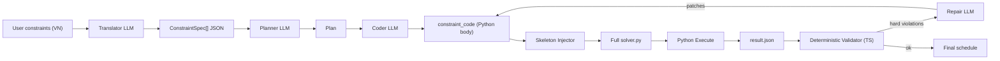

<aside>
📌

**Mục đích**: Guide chi tiết để team refactor backend AI pipeline của Tack Timetable. Mỗi task = 1 PR riêng. Đọc kỹ phần "Cách dùng guide" trước khi bắt đầu.

**Owner spec**: Dũng Lê Xuân · **Version**: 1.0 · **Updated**: 2026-05-28

**Codebase target**: branch `main`, commit hiện tại (trước refactor).

</aside>

## Cách dùng guide này

1. **1 task = 1 PR**. Không gộp nhiều task vào 1 PR. Nếu task phụ thuộc nhau, làm theo thứ tự Sprint.
2. Trước khi code, **đọc toàn bộ task** (mục Trước khi sửa + Code mẫu + Acceptance). Đừng skip.
3. **Code mẫu là copy-paste ready**. Đừng "tự sáng tạo lại" — đã có nhiều trường hợp code sai vì viết lại. Nếu thấy chỗ nào không hợp lý, comment vào PR thay vì tự đổi.
4. **Test bắt buộc**. Task nào có mục "Test" thì PR phải có test file kèm theo. CI fail = không merge.
5. **Acceptance criteria** là điều kiện cần để PR được merge. Reviewer dùng checklist này.
6. Khi gặp vướng, ghi vào mục "Câu hỏi mở" của task tương ứng và tag người spec.
7. Mỗi PR phải chạy `npm run lint` + `npm test` + `pytest python/` và pass hết trước khi review.

<aside>
⚠️

**Quy tắc bất biến** (vi phạm = revert PR):

- KHÔNG sửa file khác ngoài file ghi trong task.
- KHÔNG đổi tên hàm/class trừ khi task yêu cầu.
- KHÔNG copy-paste code từ ChatGPT/Copilot mà không đọc hiểu — guide này đã có đầy đủ code chuẩn.
- KHÔNG bỏ qua test vì "chạy local OK".
</aside>

## Tổng quan pipeline hiện tại



File entry: [`src/features/timetable/ai/local-agent.ts`](http://local-agent.ts) (orchestrator).

## Roadmap tổng

| Sprint | Tên | Số task | Ước lượng | Tác động |
| --- | --- | --- | --- | --- |
| **1** | Quick wins (correctness) | 5 | 1-2 ngày | Hallucination -40%, ổn định +30% |
| **2** | Sandbox + security | 3 | 2-3 ngày | Bảo mật ✅ |
| **3** | Helper extraction (deterministic templates) | 3 | 3-4 ngày | Token -60%, hallucination -80% |
| **4** | Cache + streaming | 4 | 2 ngày | UX + perf |
| **5** | Pre-solver + IIS | 2 | 3 ngày | Diagnostic quality |
| **6** | Consolidation | 3 | 2 ngày | Maintenance -50% |

---

# Sprint 1 — Quick wins

Mục tiêu: vá các bug đang gây sai code Python và tốn attempt vô ích. Tất cả các task Sprint 1 nên xong trong **1-2 ngày**.

## Task 1.1 — Fix Coder prompt: điền đầy đủ template còn dở

<aside>
🔴

**Đây là task quan trọng nhất Sprint 1.** Coder prompt hiện đang có 2 chỗ "TODO" mà LLM phải tự điền — và LLM điền **sai 90% lần**. Sau task này, hallucination về reified-implication sẽ giảm mạnh.

</aside>

### File cần sửa

- `prompts/coder.system.md`
- `public/prompts/coder.system.md` *(phải đồng bộ 2 file)*

### Trước khi sửa

Đọc cả file `prompts/coder.system.md`. Tìm 2 chỗ này:

**Chỗ 1** — section `### subject_consecutive (hard pair, length=2)`:

```python
elif spec["kind"] == "subject_consecutive":
	subj = spec["params"]["subject"]; L = spec["params"]["length"]
	target = spec["params"].get("classes") or data["classes"]
	for cls in target:
		cls_asgs = [a for a in data["assignments"] if a["class"] == cls and a["subject"] == subj]
		# Để đơn giản hóa: yêu cầu mỗi cụm L tiết liên tiếp
		# Tạo biến block_start[d,p] = 1 nếu môn này bắt đầu lúc (d,p)
		for d in data["days"]:
			for p in data["periods"]:
				if p + L - 1 not in data["periods"]: continue
				# ... (template phức tạp — xem note)
```

**Chỗ 2** — section `def _add_implied(...)`:

```python
# ... tiếp các kind khác tương tự ...
```

Cả 2 chỗ này là "LLM tự điền" → sai.

### Code thay thế

**Thay chỗ 1** bằng template canonical sau:

```python
elif spec["kind"] == "subject_consecutive":
	subj = spec["params"]["subject"]
	L = int(spec["params"]["length"])
	target = spec["params"].get("classes") or data["classes"]
	for cls in target:
		cls_asgs = [a for a in data["assignments"] if a["class"] == cls and a["subject"] == subj]
		if not cls_asgs:
			continue
		for d in data["days"]:
			day_periods = data["periodsByDay"].get(d, data["periods"])
			# block_at[p] = 1 nếu môn bắt đầu chuỗi L tiết tại period p
			block_at = {}
			for i in range(len(day_periods) - L + 1):
				window = day_periods[i:i+L]
				# Chỉ tạo block nếu L tiết liền kề (period[i+1] == period[i]+1)
				if any(window[k+1] != window[k] + 1 for k in range(L-1)):
					continue
				b = model.NewBoolVar(f"block_{spec['id']}_{cls}_{d}_{window[0]}")
				block_at[window[0]] = (b, window)
				# b == 1 iff TẤT CẢ L slot trong window đều có 1 assignment cls/subj
				slot_vars = [
					sum(slots[(a["id"], d, p)] for a in cls_asgs)
					for p in window
				]
				for sv in slot_vars:
					model.Add(sv >= b)
				model.Add(sum(slot_vars) >= L * b)
				model.Add(sum(slot_vars) <= L + (len(slot_vars) - L) * (1 - b))
			# Mọi tiết của môn trong ngày phải nằm trong đúng 1 block
			total_day = sum(slots[(a["id"], d, p)] for a in cls_asgs for p in day_periods)
			model.Add(total_day == L * sum(b for (b, _) in block_at.values()))
```

**Thay chỗ 2** bằng đoạn `_add_implied` đầy đủ (12 kind):

```python
def _add_implied(model, B, sub_spec, slots, data):
	"""Apply sub_spec chỉ khi B == 1. Dùng OnlyEnforceIf cho mọi model.Add."""
	kind = sub_spec["kind"]
	params = sub_spec["params"]

	def _periods_for(d):
		return data["periodsByDay"].get(d, data["periods"])

	if kind == "teacher_block_day":
		t, d = params["teacher"], params["day"]
		for a in data["assignments"]:
			if a["teacher"] == t:
				for p in _periods_for(d):
					model.Add(slots[(a["id"], d, p)] == 0).OnlyEnforceIf(B)

	elif kind == "teacher_block_period":
		t, p = params["teacher"], int(params["period"])
		for a in data["assignments"]:
			if a["teacher"] == t:
				for d in data["days"]:
					if p in _periods_for(d):
						model.Add(slots[(a["id"], d, p)] == 0).OnlyEnforceIf(B)

	elif kind == "teacher_block_slot":
		t, d, p = params["teacher"], params["day"], int(params["period"])
		for a in data["assignments"]:
			if a["teacher"] == t and p in _periods_for(d):
				model.Add(slots[(a["id"], d, p)] == 0).OnlyEnforceIf(B)

	elif kind == "teacher_max_per_day":
		t, n = params["teacher"], int(params["maxPerDay"])
		teacher_asgs = [a for a in data["assignments"] if a["teacher"] == t]
		for d in data["days"]:
			total = sum(slots[(a["id"], d, p)] for a in teacher_asgs for p in _periods_for(d))
			model.Add(total <= n).OnlyEnforceIf(B)

	elif kind == "teacher_max_consecutive":
		t, n = params["teacher"], int(params["maxConsecutive"])
		teacher_asgs = [a for a in data["assignments"] if a["teacher"] == t]
		for d in data["days"]:
			periods = _periods_for(d)
			for i in range(len(periods) - n):
				window = periods[i:i+n+1]
				win_sum = sum(slots[(a["id"], d, p)] for a in teacher_asgs for p in window)
				model.Add(win_sum <= n).OnlyEnforceIf(B)

	elif kind == "subject_pin_period":
		subj = params["subject"]
		allowed = set(int(x) for x in params["periods"])
		target = params.get("classes") or data["classes"]
		for a in data["assignments"]:
			if a["subject"] == subj and a["class"] in target:
				for d in data["days"]:
					for p in _periods_for(d):
						if p not in allowed:
							model.Add(slots[(a["id"], d, p)] == 0).OnlyEnforceIf(B)

	elif kind == "class_no_double_subject_day":
		cls = params["class"]
		subj = params.get("subject")
		asgs = [a for a in data["assignments"] if a["class"] == cls and (subj is None or a["subject"] == subj)]
		for d in data["days"]:
			total = sum(slots[(a["id"], d, p)] for a in asgs for p in _periods_for(d))
			model.Add(total <= 1).OnlyEnforceIf(B)

	elif kind == "pair_not_same_slot":
		t1, t2 = params["teachers"]
		scope_day = (params.get("scope") or {}).get("day")
		days_chk = [scope_day] if scope_day else data["days"]
		asgs1 = [a for a in data["assignments"] if a["teacher"] == t1]
		asgs2 = [a for a in data["assignments"] if a["teacher"] == t2]
		for d in days_chk:
			for p in _periods_for(d):
				s1 = sum(slots[(a["id"], d, p)] for a in asgs1)
				s2 = sum(slots[(a["id"], d, p)] for a in asgs2)
				model.Add(s1 + s2 <= 1).OnlyEnforceIf(B)

	elif kind == "subject_consecutive":
		# Reified subject_consecutive phức tạp; nếu cần, FAIL EXPLICITLY thay vì viết bừa.
		raise NotImplementedError("subject_consecutive trong if_then chưa hỗ trợ — split thành 2 spec riêng.")

	elif kind == "weekly_periods_exact":
		# Đã enforce ở base; bỏ qua khi reified.
		pass

	else:
		raise NotImplementedError(f"_add_implied: kind '{kind}' chưa hỗ trợ")
```

Thêm **Addendum v3.2** vào cuối file prompt:

```markdown
## Addendum v3.2 (BẮT BUỘC ĐỌC TRƯỚC KHI SUBMIT)
- Khi gặp `kind` không có trong template tại file này, KHÔNG được tự viết. Trả về `assumptions: ["unsupported_kind:<kind>"]` và `covered_constraint_ids` KHÔNG chứa id đó.
- `_add_implied` cho `subject_consecutive` PHẢI raise NotImplementedError — không được viết phiên bản "tạm".
- Mọi loop period PHẢI dùng `data["periodsByDay"].get(d, data["periods"])`, không dùng `data["periods"]` trực tiếp khi đang lặp theo ngày.
- Period trong `params` là số nguyên 1-based. So sánh bằng `int(...)` để tránh string mismatch.
```

### Sync 2 file prompt

```bash
cp prompts/coder.system.md public/prompts/coder.system.md
```

Thêm script `scripts/sync_prompts.mjs` (nếu chưa có) chạy trong `npm run build`:

```jsx
import fs from 'node:fs';
import path from 'node:path';
const src = path.join('prompts');
const dst = path.join('public', 'prompts');
fs.mkdirSync(dst, { recursive: true });
for (const f of fs.readdirSync(src)) {
	if (f.endsWith('.md')) fs.copyFileSync(path.join(src, f), path.join(dst, f));
}
```

Và cập nhật `package.json`:

```json
"scripts": {
	"prebuild": "node scripts/sync_prompts.mjs",
	"predev": "node scripts/sync_prompts.mjs"
}
```

### Test bắt buộc

Tạo `scripts/validate_coder_prompt_models.ts` (đã có file này — extend):

```tsx
// Thêm test: prompt KHÔNG chứa các placeholder TODO
import fs from 'node:fs';
import assert from 'node:assert';

const prompt = fs.readFileSync('prompts/coder.system.md', 'utf8');

const forbiddenPatterns = [
	/template phức tạp.*xem note/i,
	/tiếp các kind khác tương tự/i,
	/\bTODO\b/i,
	/\bFIXME\b/i,
	/\.\.\.\s*\(.*\)/, // "... (anything)" pattern
];

for (const pat of forbiddenPatterns) {
	assert.ok(!pat.test(prompt), `Coder prompt vẫn còn placeholder: ${pat}`);
}

// Test: cả 12 kind đều có template trong _add_implied
const kinds = [
	'teacher_block_day', 'teacher_block_period', 'teacher_block_slot',
	'teacher_max_per_day', 'teacher_max_consecutive',
	'subject_pin_period', 'subject_consecutive', 'class_no_double_subject_day',
	'weekly_periods_exact', 'pair_not_same_slot',
];
const addImpliedSection = prompt.split('def _add_implied')[1] ?? '';
for (const k of kinds) {
	assert.ok(
		addImpliedSection.includes(`kind == "${k}"`) || addImpliedSection.includes(`kind == '${k}'`),
		`_add_implied thiếu kind: ${k}`
	);
}

console.log('Coder prompt validation passed');
```

Thêm vào `package.json`:

```json
"test:prompt": "tsx scripts/validate_coder_prompt_models.ts"
```

Và include vào CI (`.github/workflows/ci.yml`):

```yaml
- run: npm run test:prompt
```

### Acceptance criteria

- [ ]  `prompts/coder.system.md` và `public/prompts/coder.system.md` đồng bộ (`diff` = 0).
- [ ]  Không còn pattern `"... (template phức tạp — xem note)"` trong prompt.
- [ ]  `_add_implied` có nhánh `if/elif` đầy đủ cho 10 kind (loại trừ `if_then`, `custom_dsl`).
- [ ]  `npm run test:prompt` pass.
- [ ]  Smoke test: chạy `npm run dev`, nhập 1 ràng buộc dạng "Sơn nếu dạy thứ 2 thì Hương không dạy thứ 3" → AI sinh được code có `OnlyEnforceIf(B)` cho mọi `model.Add` trong block.

### Câu hỏi mở

- Nếu kind nào trong `_add_implied` quá phức tạp (ví dụ `subject_consecutive` reified), confirm với spec owner xem có nên throw `NotImplementedError` hay không.

---

## Task 1.2 — Atomic applyRepairPatches

### Vấn đề hiện tại

`src/features/timetable/ai/repair.ts`, function `applyRepairPatches`:

```tsx
export function applyRepairPatches(source: string, patches: ...): string {
	let updated = source;
	for (const patch of patches) {
		if (!patch.oldStr) continue;
		if (!updated.includes(patch.oldStr)) {
			throw new Error(`Repair patch failed to apply: oldStr not found.\n${patch.oldStr.slice(0, 100)}`);
		}
		updated = updated.replace(patch.oldStr, patch.newStr);
	}
	return updated;
}
```

Bugs:

1. `String.prototype.replace(str, str)` chỉ replace **first match**. Nếu LLM định replaceAll thì sai.
2. **Không atomic**: patch[0] success → `updated` đổi → patch[1] `oldStr` có thể không match nữa (vì đã bị patch[0] xóa context) → throw → nhưng `updated` đã chứa patch[0] → code lai tạp escape ra ngoài qua `pendingRepairPatches`.
3. Nếu cùng `oldStr` xuất hiện 2 lần trong source → `replace` chọn ngẫu nhiên lần đầu, có thể không phải chỗ LLM muốn.

### Code thay thế

```tsx
export function applyRepairPatches(
	source: string,
	patches: RepairTurnResult['patches']
): string {
	// 1) Validate TẤT CẢ patches trên source GỐC trước khi apply bất kỳ patch nào (atomic).
	const plan: Array<{ index: number; patch: typeof patches[0] }> = [];
	for (const patch of patches) {
		if (!patch.oldStr) continue;
		const occurrences = source.split(patch.oldStr).length - 1;
		if (occurrences === 0) {
			throw new Error(
				`Repair patch oldStr not found in source. Preview: ${patch.oldStr.slice(0, 120)}`
			);
		}
		if (occurrences > 1 && !patch.replaceAll) {
			throw new Error(
				`Repair patch ambiguous: oldStr xuất hiện ${occurrences} lần. Mở rộng context hoặc set replaceAll=true. Preview: ${patch.oldStr.slice(0, 120)}`
			);
		}
		plan.push({ index: source.indexOf(patch.oldStr), patch });
	}

	// 2) Apply theo thứ tự xuất hiện trong source (tránh overlap).
	plan.sort((a, b) => a.index - b.index);

	let updated = source;
	for (const { patch } of plan) {
		updated = patch.replaceAll
			? updated.split(patch.oldStr).join(patch.newStr)
			: updated.replace(patch.oldStr, patch.newStr);
	}
	return updated;
}
```

Cập nhật zod schema trong cùng file:

```tsx
const repairResponseSchema = z.object({
	summary: z.string(),
	patches: z.array(
		z.object({
			oldStr: z.string(),
			newStr: z.string(),
			reason: z.string(),
			replaceAll: z.boolean().optional(),  // ← THÊM
		})
	),
	assumptions: z.array(z.string()),
});
```

Và cập nhật JSON schema cho LLM (trong cùng file `repair.ts`, biến `chatPayload.response_format.json_schema.schema.properties.patches.items.properties`):

```tsx
properties: {
	oldStr: { type: 'string' },
	newStr: { type: 'string' },
	reason: { type: 'string' },
	replaceAll: { type: 'boolean' },  // ← THÊM
},
required: ['oldStr', 'newStr', 'reason'],
```

Cập nhật `prompts/repair.system.md` — thêm vào mục "Output":

```markdown
- `replaceAll`: boolean optional. Mặc định false (chỉ replace 1 lần). Set true khi muốn áp dụng cho mọi occurrence (vd: đổi tên biến).
- Nếu `oldStr` xuất hiện nhiều lần trong `currentCode`, BẮT BUỘC hoặc (a) mở rộng `oldStr` để unique, hoặc (b) set `replaceAll: true`.
```

### Wrap call site

Trong `src/features/timetable/ai/local-agent.ts`, tìm chỗ:

```tsx
if (pendingRepairPatches?.length && latestConstraintCode) {
	latestConstraintCode = applyRepairPatches(latestConstraintCode, pendingRepairPatches);
	pendingRepairPatches = null;
	emit(config, { ... 'Applied repair patches' ... });
}
```

Wrap bằng try/catch để treat patch-apply-fail như coder attempt mới:

```tsx
if (pendingRepairPatches?.length && latestConstraintCode) {
	try {
		latestConstraintCode = applyRepairPatches(latestConstraintCode, pendingRepairPatches);
		pendingRepairPatches = null;
		emit(config, {
			type: 'stage_completed',
			stage: 'coder',
			attempt,
			message: 'Applied repair patches from previous round',
		});
	} catch (err) {
		const message = err instanceof Error ? err.message : 'Repair patch failed';
		previousAttemptSummary = digestError(`Repair patch apply failed: ${message}`);
		board.setErrorDigest(previousAttemptSummary);
		pendingRepairPatches = null;
		coderRetry += 1;
		emit(config, {
			type: 'error',
			message: `Repair patch apply failed at attempt ${attempt}: ${message}`,
			fatal: false,
		});
		continue;  // back to top of inner while → regenerate code from scratch
	}
}
```

### Test bắt buộc

Tạo `src/features/timetable/ai/repair.test.ts`:

```tsx
import { describe, expect, it } from 'vitest';
import { applyRepairPatches } from './repair';

describe('applyRepairPatches', () => {
	it('applies single patch', () => {
		const src = 'foo bar baz';
		const result = applyRepairPatches(src, [
			{ oldStr: 'bar', newStr: 'BAR', reason: 'test' },
		]);
		expect(result).toBe('foo BAR baz');
	});

	it('rejects ambiguous oldStr when replaceAll not set', () => {
		const src = 'foo foo bar';
		expect(() =>
			applyRepairPatches(src, [{ oldStr: 'foo', newStr: 'FOO', reason: 'test' }])
		).toThrow(/ambiguous/i);
	});

	it('accepts replaceAll for repeated oldStr', () => {
		const src = 'foo foo bar';
		const result = applyRepairPatches(src, [
			{ oldStr: 'foo', newStr: 'FOO', reason: 'test', replaceAll: true },
		]);
		expect(result).toBe('FOO FOO bar');
	});

	it('is atomic: rejects all if one patch invalid', () => {
		const src = 'foo bar baz';
		expect(() =>
			applyRepairPatches(src, [
				{ oldStr: 'bar', newStr: 'BAR', reason: 'ok' },
				{ oldStr: 'NOT_PRESENT', newStr: 'X', reason: 'fail' },
			])
		).toThrow(/not found/i);
	});

	it('applies multiple patches in source-order, not list-order', () => {
		const src = 'AAA BBB CCC';
		const result = applyRepairPatches(src, [
			{ oldStr: 'CCC', newStr: 'ccc', reason: 'late-in-list' },
			{ oldStr: 'AAA', newStr: 'aaa', reason: 'early-in-list' },
		]);
		expect(result).toBe('aaa BBB ccc');
	});
});
```

### Acceptance criteria

- [ ]  `applyRepairPatches` không bao giờ produce code lai tạp.
- [ ]  Validation chạy 100% trên source gốc trước khi apply.
- [ ]  Hỗ trợ `replaceAll`.
- [ ]  Tất cả test mới pass.
- [ ]  `prompts/repair.system.md` đã cập nhật và sync sang `public/prompts/`.
- [ ]  Smoke test: trong DevTools, gọi `__localAgentInternal.shouldRepairExecutableFailure` không thay đổi behavior.

---

## Task 1.3 — `ensureCoverage` không throw, auto-patch coverage

### Vấn đề

`src/features/timetable/ai/coder.ts`:

```tsx
function ensureCoverage(result, specs) {
	const missing = hardIds.filter((id) => !covered.has(id));
	if (missing.length) {
		throw new Error(`Coder failed to cover hard constraints: ${missing.join(', ')}`);
	}
	return result;
}
```

→ Throw khi LLM viết code đúng nhưng quên liệt kê id. Trong `local-agent.ts`, throw này được catch và tính là **1 attempt thất bại** → tốn 1 retry mà không sửa được gì.

### Code thay thế

```tsx
function ensureCoverage(result: CoderTurnResult, specs: ConstraintSpec[]): CoderTurnResult {
	const hardIds = specs
		.filter((spec) => spec.severity === 'hard')
		.filter((spec) => !(spec.kind === 'weekly_periods_exact' && spec.tags?.includes('auto_base')))
		.map((spec) => spec.id);

	const covered = new Set(result.covered_constraint_ids);
	const missing = hardIds.filter((id) => !covered.has(id));

	if (missing.length === 0) return result;

	// Heuristic: nếu code có ít nhất 1 `model.Add` cho mỗi missing id (theo comment hoặc tên),
	// auto-add vào covered. Nếu KHÔNG có dấu hiệu, mới throw.
	const evidenceMissing = missing.filter((id) => {
		// Search code cho dấu hiệu xử lý spec này (comment, hoặc reference id)
		const codeMentionsId = result.constraint_code.includes(id) ||
			result.constraint_code.includes(`spec["id"] == "${id}"`);
		return !codeMentionsId;
	});

	if (evidenceMissing.length > 0) {
		throw new Error(
			`Coder failed to cover hard constraints (no code reference): ${evidenceMissing.join(', ')}`
		);
	}

	// Auto-patch coverage list — code có vẻ đã xử lý nhưng LLM quên list.
	return {
		...result,
		covered_constraint_ids: [...new Set([...result.covered_constraint_ids, ...missing])],
		assumptions: [...result.assumptions, `auto_added_coverage:${missing.join(',')}`],
	};
}
```

### Test bắt buộc

Tạo `src/features/timetable/ai/coder.test.ts` (hoặc append nếu đã có):

```tsx
import { describe, expect, it } from 'vitest';
import { runCoderTurn } from './coder';
// Helper: mock invokeChat
const fakeChat = (content: string) => async () => ({ content, usage: { total_tokens: 100 } });

describe('ensureCoverage', () => {
	it('auto-patches when code mentions id but list is empty', async () => {
		const response = JSON.stringify({
			plan_summary: 'ok',
			constraint_code: 'for spec in data["constraints"]:\n\tif spec["id"] == "c1": pass',
			covered_constraint_ids: [],
			assumptions: [],
		});
		const result = await runCoderTurn(
			{ baseURL: '', apiKey: 'x', model: 'm' },
			{
				dataset: {
					classes: [], days: [], periods: [], assignments: [],
					constraints: [{ id: 'c1', original: '', severity: 'hard', kind: 'custom_dsl', params: {} } as any],
					datasetDigest: { classCount: 0, teacherCount: 0, dayCount: 0, periodCount: 0, totalAssignments: 0 },
				},
				plan: {} as any,
			},
			fakeChat(response)
		);
		expect(result.covered_constraint_ids).toContain('c1');
		expect(result.assumptions.some(a => a.startsWith('auto_added_coverage:'))).toBe(true);
	});

	it('throws when code has no evidence of handling id', async () => {
		const response = JSON.stringify({
			plan_summary: 'ok',
			constraint_code: '# nothing relevant',
			covered_constraint_ids: [],
			assumptions: [],
		});
		await expect(
			runCoderTurn(
				{ baseURL: '', apiKey: 'x', model: 'm' },
				{
					dataset: {
						classes: [], days: [], periods: [], assignments: [],
						constraints: [{ id: 'c1', original: '', severity: 'hard', kind: 'custom_dsl', params: {} } as any],
						datasetDigest: { classCount: 0, teacherCount: 0, dayCount: 0, periodCount: 0, totalAssignments: 0 },
					},
					plan: {} as any,
				},
				fakeChat(response)
			)
		).rejects.toThrow(/no code reference/);
	});
});
```

### Acceptance criteria

- [ ]  `ensureCoverage` auto-patch khi code có evidence, throw khi không.
- [ ]  Test pass.
- [ ]  Log/assumption "auto_added_coverage" xuất hiện được trong UI debug panel.

---

## Task 1.4 — Fix status mapping trong `code_executor.py`

### Vấn đề

`python/code_executor.py` line ~119:

```python
if marker_count == 1:
	status = "optimal" if status == "unknown" else status
if no_solution_marker and status in {"optimal", "feasible"}:
	status = "infeasible"
```

Logic này override status thật từ `result.json`. CP-SAT phân biệt rõ `OPTIMAL` vs `FEASIBLE` — feasible nghĩa là tìm được lời giải nhưng chưa chắc tối ưu. Việc gắn cờ "optimal" sai làm validator/agent đưa ra quyết định không chính xác.

### Code thay thế

Xóa cả 2 block override trên. Trust `result.json["status"]` (đã được set từ `solver.StatusName(status).lower()`).

```python
schedule = result_json.get("schedule", []) if isinstance(result_json, dict) else []
status_raw = result_json.get("status", "unknown") if isinstance(result_json, dict) else "unknown"
status = _map_status(str(status_raw))

# REMOVED: marker_count override
# REMOVED: no_solution_marker conflict

# Validation sanity: nếu schedule trống mà status nói optimal/feasible → ép infeasible.
if status in {"optimal", "feasible"} and not schedule:
	status = "infeasible"
```

Đồng thời, dọn artifact cũ (mục Task 1.5).

### Acceptance criteria

- [ ]  Status từ executor khớp 1-1 với `result.json["status"]` (ngoại trừ sanity guard cho schedule trống).
- [ ]  Solver chạy với 1 input feasible nhỏ → executor trả `status: "feasible"` hoặc `"optimal"` đúng như CP-SAT.
- [ ]  Test: thêm `python/tests/test_executor_status.py` với 3 case (optimal, infeasible, schedule trống).

---

## Task 1.5 — Cleanup artifact `.ai_results/`

### Vấn đề

`python/code_executor.py` line ~157:

```python
artifact_dir = Path.cwd() / ".ai_results"
artifact_dir.mkdir(parents=True, exist_ok=True)
artifact_path = artifact_dir / f"result_{int(time.time() * 1000)}.json"
```

Mỗi lần chạy đẻ ra 1 file, không bao giờ dọn → đầy disk.

### Code thay thế

Thay đoạn artifact bằng:

```python
artifact_dir = Path.cwd() / ".ai_results"
artifact_dir.mkdir(parents=True, exist_ok=True)

# Cleanup: giữ tối đa 50 file gần nhất
_MAX_ARTIFACTS = 50
existing = sorted(artifact_dir.glob("result_*.json"), key=lambda p: p.stat().st_mtime)
for old in existing[:-_MAX_ARTIFACTS]:
	try:
		old.unlink()
	except OSError:
		pass

artifact_path = artifact_dir / f"result_{int(time.time() * 1000)}.json"
artifact_path.write_text(json.dumps(result_json, ensure_ascii=False), encoding="utf-8")
```

Thêm vào `.gitignore` (kiểm tra có chưa, nếu chưa thì add):

```
.ai_results/
```

### Acceptance criteria

- [ ]  Sau 100 lần chạy, `.ai_results/` chỉ có 50 file.
- [ ]  `.ai_results/` trong `.gitignore`.

---

# Sprint 2 — Sandbox + Security

Mục tiêu: code AI sinh ra CHẠY TRONG SANDBOX, không trên host. Hiện tại `python-execute` route đang spawn `python3` trực tiếp → critical security gap.

## Task 2.1 — Wire bubblewrap/docker vào python-execute route

### Vấn đề

`src/app/api/ai/python-execute/route.ts` đang `spawn('python3', [executorPath], { cwd: jobDir })` trực tiếp trên host. Không cap-drop, không network=none, không memory limit.

Đã có sẵn `sandbox/executor.py` (Docker) và `sandbox/bubblewrap_executor.py` (bwrap) — chưa wire vào.

### Bước 1: Sửa `sandbox/bubblewrap_executor.py`

Thay dòng `"--share-net"` bằng `"--unshare-net"` (Coder code không được phép truy cập network):

```python
cmd = [
	"bwrap",
	"--ro-bind", "/usr", "/usr",
	"--ro-bind", "/lib", "/lib",
	"--ro-bind", "/lib64", "/lib64",
	"--ro-bind", "/bin", "/bin",
	"--ro-bind", "/sbin", "/sbin",
	"--ro-bind", "/etc", "/etc",
	"--ro-bind", "/opt", "/opt",
	"--proc", "/proc",
	"--dev", "/dev",
	"--tmpfs", "/tmp",
	"--bind", str(workspace_dir), "/workspace",
	"--chdir", "/workspace",
	"--unshare-all",
	# BỎ: "--share-net",
	"--die-with-parent",
	"--new-session",
	"python", str(file_path.name),
]
```

Đồng bộ marker detection (đổi `"SOLUTION FOUND"` → `"SOLUTION_FOUND"` — có underscore, khớp với skeleton):

```python
success = result.returncode == 0 and "SOLUTION_FOUND" in output.upper()
```

### Bước 2: Sửa `sandbox/executor.py` (Docker)

Đồng bộ marker detection:

```python
success = result.returncode == 0 and (
	"SOLUTION_FOUND" in output.upper() or "✅" in output
)
```

### Bước 3: Tạo router file mới `sandbox/run.py`

```python
#!/usr/bin/env python3
"""
Dispatcher: chọn sandbox phù hợp dựa theo env TT_SANDBOX_MODE.
Values: "docker" | "bwrap" | "none".
Default: auto-detect (bwrap nếu Linux + bwrap available, docker nếu Docker available, else error).
"""
from __future__ import annotations
import os
import platform
import shutil
import sys
from pathlib import Path
from typing import Any

def _auto_mode() -> str:
	if platform.system() == "Linux" and shutil.which("bwrap"):
		return "bwrap"
	if shutil.which("docker"):
		return "docker"
	return "none"

def run_sandboxed(file_path: str, timeout: int = 120, workspace_dir: str | None = None) -> dict[str, Any]:
	mode = os.environ.get("TT_SANDBOX_MODE", _auto_mode()).lower()

	if mode == "docker":
		from sandbox.executor import run_in_sandbox
		return run_in_sandbox(file_path=file_path, timeout=timeout, workspace_dir=workspace_dir)

	if mode == "bwrap":
		from sandbox.bubblewrap_executor import run_with_bubblewrap
		return run_with_bubblewrap(file_path=file_path, timeout=timeout, workspace_dir=workspace_dir)

	if mode == "none":
		# Dev only — phải set TT_SANDBOX_ALLOW_UNSAFE=1 để confirm.
		if os.environ.get("TT_SANDBOX_ALLOW_UNSAFE") != "1":
			raise RuntimeError(
				"No sandbox available (no Docker, no bwrap). Set TT_SANDBOX_ALLOW_UNSAFE=1 to bypass (DEV ONLY)."
			)
		import subprocess
		cwd = Path(workspace_dir) if workspace_dir else Path(file_path).resolve().parent
		result = subprocess.run(
			[sys.executable, str(Path(file_path).resolve())],
			cwd=cwd, capture_output=True, text=True, timeout=timeout
		)
		output = (result.stdout or "") + (result.stderr or "")
		return {
			"success": result.returncode == 0 and "SOLUTION_FOUND" in output.upper(),
			"return_code": result.returncode,
			"stdout": result.stdout,
			"stderr": result.stderr,
			"combined_output": output[:6000],
			"sandbox": "none",
		}

	raise ValueError(f"Unknown TT_SANDBOX_MODE: {mode}")
```

### Bước 4: Cập nhật `python/code_executor.py` để dùng sandbox

Thay đoạn `run_proc = subprocess.run(...)` bằng:

```python
from sandbox.run import run_sandboxed

try:
	sandbox_result = run_sandboxed(
		file_path=str(solver_path),
		timeout=timeout,
		workspace_dir=str(workspace),
	)
except Exception as exc:
	return {
		"phase": "run",
		"ok": False,
		"status": "crashed",
		"durationMs": int((time.time() - started) * 1000),
		"errorDigest": _digest_error(str(exc)),
		"stdout": "",
		"stderr": str(exc),
	}

stdout = sandbox_result.get("stdout", "") or ""
stderr = sandbox_result.get("stderr", "") or ""
return_code = sandbox_result.get("return_code", -1)

if sandbox_result.get("sandbox") == "docker" and not sandbox_result.get("success"):
	# Timeout detection từ Docker wrapper
	if "timed out" in (sandbox_result.get("stderr", "") or "").lower():
		return {
			"phase": "run",
			"ok": False,
			"status": "timeout",
			"durationMs": int((time.time() - started) * 1000),
			"errorDigest": f"Execution timed out after {timeout}s",
			"stdout": _truncate_output(stdout),
			"stderr": _truncate_output(stderr),
		}
```

Lưu ý: sau khi sandbox run, `result.json` được ghi vào `workspace_dir` (mount vào sandbox). Logic đọc `result.json` không đổi.

### Bước 5: Document trong `sandbox/README.md`

Thêm section:

```markdown
## Cách production deploy chọn sandbox

Set env var `TT_SANDBOX_MODE`:
- `bwrap` (recommended cho Linux server)
- `docker` (recommended cho Mac/Windows hoặc cần isolation mạnh hơn)
- `none` (dev only, phải set `TT_SANDBOX_ALLOW_UNSAFE=1`)

Auto-detect nếu không set:
- Linux + bwrap installed → bwrap
- Docker installed → docker
- Else → error (refuse to run unsafe)
```

### Test bắt buộc

Tạo `python/tests/test_sandbox_dispatch.py`:

```python
import os
import pytest
from unittest.mock import patch

from sandbox.run import _auto_mode, run_sandboxed

def test_auto_mode_picks_bwrap_on_linux_when_available(monkeypatch):
	monkeypatch.setattr("platform.system", lambda: "Linux")
	monkeypatch.setattr("shutil.which", lambda cmd: "/usr/bin/bwrap" if cmd == "bwrap" else None)
	assert _auto_mode() == "bwrap"

def test_auto_mode_falls_back_to_docker(monkeypatch):
	monkeypatch.setattr("platform.system", lambda: "Darwin")
	monkeypatch.setattr("shutil.which", lambda cmd: "/usr/bin/docker" if cmd == "docker" else None)
	assert _auto_mode() == "docker"

def test_none_mode_refuses_without_allow_unsafe(monkeypatch, tmp_path):
	monkeypatch.setenv("TT_SANDBOX_MODE", "none")
	monkeypatch.delenv("TT_SANDBOX_ALLOW_UNSAFE", raising=False)
	file = tmp_path / "x.py"
	file.write_text("print('hi')")
	with pytest.raises(RuntimeError, match="TT_SANDBOX_ALLOW_UNSAFE"):
		run_sandboxed(str(file))
```

### Acceptance criteria

- [ ]  `python-execute` route gián tiếp đi qua `sandbox/run.py`.
- [ ]  Khi `TT_SANDBOX_MODE=none` và không có `TT_SANDBOX_ALLOW_UNSAFE=1`, executor REFUSE chạy.
- [ ]  `bubblewrap_executor.py` không còn `--share-net`.
- [ ]  Marker detection: cả 2 sandbox check `SOLUTION_FOUND` (có underscore).
- [ ]  Smoke test: trên Linux dev machine có bwrap, chạy 1 task xếp lịch → success.
- [ ]  `pytest python/tests/test_sandbox_dispatch.py` pass.

### Câu hỏi mở

- Server prod chạy Linux nào, có install bwrap chưa? Nếu chưa → coordinate với ops trước khi merge.

---

## Task 2.2 — AST-based forbidden imports/calls check

### Vấn đề

Hiện tại `coder.ts` filter token bằng `string.includes("import ")`:

```tsx
const forbidden = ['import ', 'print(', 'open(', '__import__'];
const hit = forbidden.find((token) => result.constraint_code.includes(token));
```

Vấn đề:

- Silent-delete dòng có `import` → nếu LLM định nghĩa helper class có `from typing import ...` ở đầu file → bị xóa → code không chạy được.
- Không catch được `getattr(__builtins__, "open")` hay similar evasion.
- Không catch được multi-line `import` qua backslash continuation.

### Code thay thế

Tạo file mới `src/app/api/ai/python-ast-check/route.ts`:

```tsx
import fs from 'node:fs';
import os from 'node:os';
import path from 'node:path';
import { spawnSync } from 'node:child_process';
import { NextResponse } from 'next/server';

type CheckPayload = {
	code?: string;
};

const CHECKER_SCRIPT = `
import ast, json, sys
FORBIDDEN_NAMES = {"open", "exec", "eval", "__import__", "compile", "input", "breakpoint", "globals", "locals", "vars"}
FORBIDDEN_ATTRS = {"__import__", "__builtins__", "__class__", "__bases__", "__subclasses__", "__mro__"}

try:
	tree = ast.parse(sys.stdin.read())
except SyntaxError as exc:
	print(json.dumps({"ok": False, "error": f"SyntaxError: {exc}"}))
	sys.exit(0)

errors = []
for node in ast.walk(tree):
	if isinstance(node, (ast.Import, ast.ImportFrom)):
		errors.append(f"Forbidden import at line {node.lineno}")
	elif isinstance(node, ast.Call):
		fn = node.func
		name = getattr(fn, "id", None) or getattr(fn, "attr", None)
		if name in FORBIDDEN_NAMES:
			errors.append(f"Forbidden call '{name}' at line {node.lineno}")
	elif isinstance(node, ast.Attribute):
		if node.attr in FORBIDDEN_ATTRS:
			errors.append(f"Forbidden attribute '{node.attr}' at line {node.lineno}")

print(json.dumps({"ok": len(errors) == 0, "error": "; ".join(errors) if errors else None}))
`;

export async function POST(request: Request) {
	try {
		const body = (await request.json()) as CheckPayload;
		const code = String(body.code ?? '');
		if (!code.trim()) {
			return NextResponse.json({ ok: false, error: 'Missing python code.' }, { status: 400 });
		}
		const tempDir = fs.mkdtempSync(path.join(os.tmpdir(), 'tt-ast-'));
		try {
			const result = spawnSync('python3', ['-c', CHECKER_SCRIPT], {
				input: code,
				encoding: 'utf8',
				cwd: tempDir,
			});
			if (result.status !== 0) {
				return NextResponse.json({
					ok: false,
					error: `AST check failed: ${result.stderr || result.stdout}`,
				}, { status: 500 });
			}
			const parsed = JSON.parse(result.stdout.trim() || '{"ok":true}');
			return NextResponse.json({ ok: true, result: parsed });
		} finally {
			fs.rmSync(tempDir, { recursive: true, force: true });
		}
	} catch (error) {
		return NextResponse.json({
			ok: false,
			error: error instanceof Error ? error.message : 'Unknown AST check error',
		}, { status: 500 });
	}
}
```

### Sửa `coder.ts`

Xóa hoàn toàn function `reflectConstraintCode` (silent-delete approach). Thay bằng AST check downstream.

Trong `skeleton-injector.ts`, thêm function:

```tsx
export async function astCheckPython(code: string): Promise<{ ok: boolean; error?: string }> {
	try {
		const response = await fetch('/api/ai/python-ast-check', {
			method: 'POST',
			headers: { 'Content-Type': 'application/json' },
			body: JSON.stringify({ code }),
		});
		const payload = await response.json() as { ok?: boolean; result?: { ok?: boolean; error?: string }; error?: string };
		if (!response.ok || !payload.ok || !payload.result) {
			return { ok: false, error: payload.error || 'AST check API failed.' };
		}
		return { ok: Boolean(payload.result.ok), error: payload.result.error };
	} catch (error) {
		return { ok: false, error: error instanceof Error ? error.message : 'AST check failed.' };
	}
}
```

Trong `local-agent.ts`, ngay sau `syntaxCheckPython`, thêm:

```tsx
const astCheck = await astCheckPython(injected.solverCode);
if (!astCheck.ok) {
	previousAttemptSummary = digestError(astCheck.error || 'AST check rejected the generated code.');
	board.setErrorDigest(previousAttemptSummary);
	coderRetry += 1;
	emit(config, {
		type: 'error',
		message: `AST check failed at attempt ${attempt}: ${previousAttemptSummary}`,
		fatal: false,
	});
	continue;
}
```

### Acceptance criteria

- [ ]  Xóa `reflectConstraintCode` khỏi `coder.ts`.
- [ ]  AST check route hoạt động, reject mọi import/`open`/`exec`/`eval`/`__import__`/`__builtins__`.
- [ ]  LLM tạo code có `import os` → check fail, agent retry.
- [ ]  LLM tạo code có `getattr(__builtins__, "open")` → check fail.
- [ ]  Test: thêm test case cho 5 evasion patterns.

---

## Task 2.3 — API key qua header thay vì body

### Vấn đề

API key đi qua request body → hiển thị trong DevTools Network tab + có thể log vào Next.js middleware.

### Code thay thế

**Trong tất cả file gọi `/api/ai/chat`** (`translator.ts`, `planner.ts`, `coder.ts`, `repair.ts`):

Từ:

```tsx
body: JSON.stringify(payload)  // chứa apiKey
```

Thành:

```tsx
const { apiKey, ...payloadWithoutKey } = payload as any;
fetch('/api/ai/chat', {
	method: 'POST',
	headers: {
		'Content-Type': 'application/json',
		'X-Provider-Key': apiKey,
	},
	body: JSON.stringify(payloadWithoutKey),
})
```

**Tốt hơn**: tạo helper chung `src/features/timetable/ai/chat-client.ts`:

```tsx
import type { ChatUsage } from './types';

export interface ChatPayload {
	baseURL: string;
	apiKey: string;
	model: string;
	messages: Array<{ role: string; content: string }>;
	temperature?: number;
	max_tokens?: number;
	response_format?: Record<string, unknown>;
	cache_control?: Record<string, unknown>;
}

export async function invokeChat(
	payload: ChatPayload
): Promise<{ content?: string; usage?: ChatUsage }> {
	const { apiKey, ...rest } = payload;
	const response = await fetch('/api/ai/chat', {
		method: 'POST',
		headers: {
			'Content-Type': 'application/json',
			'X-Provider-Key': apiKey,
		},
		body: JSON.stringify(rest),
	});
	const body = await response.json().catch(() => null);
	if (!response.ok || !body?.ok) {
		throw new Error(body?.error || `Chat API failed with status ${response.status}`);
	}
	return { content: String(body.content ?? ''), usage: body.usage as ChatUsage | undefined };
}
```

Replace `defaultInvokeChat` trong cả 4 file (`translator/planner/coder/repair`) bằng import `invokeChat` từ helper.

**Trong `src/app/api/ai/chat/route.ts`**:

Từ:

```tsx
const body = (await request.json()) as ChatPayload;
const apiKey = String(body.apiKey ?? '').trim();
```

Thành:

```tsx
const body = (await request.json()) as ChatPayload;
const apiKey = request.headers.get('x-provider-key')?.trim() ?? String(body.apiKey ?? '').trim();
```

(Giữ fallback đọc từ body để backward compat trong giai đoạn migrate. Có thể remove sau 1 release.)

### Acceptance criteria

- [ ]  DevTools Network tab: request `/api/ai/chat` không chứa apiKey trong body preview.
- [ ]  `X-Provider-Key` header xuất hiện trong request.
- [ ]  Backward compat: cũ vẫn chạy nếu chưa migrate hết.
- [ ]  Smoke test: chạy 1 full agent run, mọi LLM call thành công.

---

# Sprint 3 — Helper extraction (game changer)

Mục tiêu: chuyển 12 constraint templates từ prompt LLM → Python helpers thật. Sau Sprint 3, **Coder LLM chỉ phải xử lý `custom_dsl`** → token giảm ~60-80%, hallucination gần như zero cho 12 kind đã biết.

<aside>
💡

Đây là cải tiến lớn nhất về cost & accuracy. Nhưng cũng dễ làm hỏng vì nhiều file đụng nhau. **Đọc kỹ cả 3 task trước khi bắt đầu task đầu tiên.**

</aside>

## Task 3.1 — Tạo `python/constraint_templates.py`

### File mới

`python/constraint_templates.py`:

```python
"""
Constraint templates cho CP-SAT solver.

Mỗi function nhận:
	- model: cp_model.CpModel
	- slots: dict[(assignment_id, day, period)] -> BoolVar
	- data: { "days", "periods", "periodsByDay", "assignments", "classes", ... }
	- params: dict (theo ConstraintSpec.params)
	- severity: "hard" | "soft" | "info"
	- cid: str (constraint id, để log)

Return: None (mutate model in place).

Nếu severity == "soft", các function PHẢI return một BoolVar `violated` để có thể minimize.
For now, mọi function chỉ implement hard. Soft là task tương lai.
"""
from __future__ import annotations
from typing import Any, Callable
from ortools.sat.python import cp_model

def _periods_for(data: dict[str, Any], d: str) -> list[int]:
	return data.get("periodsByDay", {}).get(d) or data["periods"]

def teacher_block_day(model, slots, data, params, **kwargs):
	t = params["teacher"]
	d = params["day"]
	for a in data["assignments"]:
		if a["teacher"] == t:
			for p in _periods_for(data, d):
				model.Add(slots[(a["id"], d, p)] == 0)

def teacher_block_period(model, slots, data, params, **kwargs):
	t = params["teacher"]
	p = int(params["period"])
	for a in data["assignments"]:
		if a["teacher"] == t:
			for d in data["days"]:
				if p in _periods_for(data, d):
					model.Add(slots[(a["id"], d, p)] == 0)

def teacher_block_slot(model, slots, data, params, **kwargs):
	t = params["teacher"]
	d = params["day"]
	p = int(params["period"])
	for a in data["assignments"]:
		if a["teacher"] == t and p in _periods_for(data, d):
			model.Add(slots[(a["id"], d, p)] == 0)

def teacher_max_per_day(model, slots, data, params, **kwargs):
	t = params["teacher"]
	n = int(params["maxPerDay"])
	asgs = [a for a in data["assignments"] if a["teacher"] == t]
	for d in data["days"]:
		total = sum(slots[(a["id"], d, p)] for a in asgs for p in _periods_for(data, d))
		model.Add(total <= n)

def teacher_max_consecutive(model, slots, data, params, **kwargs):
	t = params["teacher"]
	n = int(params["maxConsecutive"])
	asgs = [a for a in data["assignments"] if a["teacher"] == t]
	for d in data["days"]:
		periods = _periods_for(data, d)
		for i in range(len(periods) - n):
			window = periods[i:i+n+1]
			win_sum = sum(slots[(a["id"], d, p)] for a in asgs for p in window)
			model.Add(win_sum <= n)

def subject_pin_period(model, slots, data, params, **kwargs):
	subj = params["subject"]
	allowed = set(int(x) for x in params["periods"])
	target = params.get("classes") or data["classes"]
	for a in data["assignments"]:
		if a["subject"] == subj and a["class"] in target:
			for d in data["days"]:
				for p in _periods_for(data, d):
					if p not in allowed:
						model.Add(slots[(a["id"], d, p)] == 0)

def subject_consecutive(model, slots, data, params, **kwargs):
	subj = params["subject"]
	L = int(params["length"])
	target = params.get("classes") or data["classes"]
	for cls in target:
		cls_asgs = [a for a in data["assignments"] if a["class"] == cls and a["subject"] == subj]
		if not cls_asgs:
			continue
		for d in data["days"]:
			day_periods = _periods_for(data, d)
			block_vars = []
			for i in range(len(day_periods) - L + 1):
				window = day_periods[i:i+L]
				if any(window[k+1] != window[k] + 1 for k in range(L-1)):
					continue
				b = model.NewBoolVar(f"block_{kwargs.get('cid','')}_{cls}_{d}_{window[0]}")
				block_vars.append((b, window))
				slot_sums = [sum(slots[(a["id"], d, p)] for a in cls_asgs) for p in window]
				for sv in slot_sums:
					model.Add(sv >= b)
				model.Add(sum(slot_sums) >= L * b)
			total_day = sum(slots[(a["id"], d, p)] for a in cls_asgs for p in day_periods)
			model.Add(total_day == L * sum(b for (b, _) in block_vars))

def class_no_double_subject_day(model, slots, data, params, **kwargs):
	cls = params["class"]
	subj = params.get("subject")
	asgs = [a for a in data["assignments"] if a["class"] == cls and (subj is None or a["subject"] == subj)]
	for d in data["days"]:
		total = sum(slots[(a["id"], d, p)] for a in asgs for p in _periods_for(data, d))
		model.Add(total <= 1)

def pair_not_same_slot(model, slots, data, params, **kwargs):
	t1, t2 = params["teachers"]
	scope_day = (params.get("scope") or {}).get("day")
	days_chk = [scope_day] if scope_day else data["days"]
	asgs1 = [a for a in data["assignments"] if a["teacher"] == t1]
	asgs2 = [a for a in data["assignments"] if a["teacher"] == t2]
	for d in days_chk:
		for p in _periods_for(data, d):
			s1 = sum(slots[(a["id"], d, p)] for a in asgs1)
			s2 = sum(slots[(a["id"], d, p)] for a in asgs2)
			model.Add(s1 + s2 <= 1)

def weekly_periods_exact(model, slots, data, params, **kwargs):
	# Đã enforce ở base. No-op.
	return

def if_then(model, slots, data, params, **kwargs):
	cond = params["if"]
	thens = params["then"]
	cid = kwargs.get("cid", "")
	B = model.NewBoolVar(f"cond_{cid}")
	_bind_condition(model, B, cond, slots, data)
	for i, sub in enumerate(thens):
		sub_kind = sub["kind"]
		if sub_kind not in REGISTRY:
			raise NotImplementedError(f"if_then sub-kind '{sub_kind}' chưa hỗ trợ")
		# Apply sub bằng OnlyEnforceIf qua wrapper riêng
		_apply_implied(model, B, sub_kind, slots, data, sub["params"], cid=f"{cid}_then{i}")

def _bind_condition(model, B, cond, slots, data):
	op = cond["op"]
	if op == "teacher_teaches_on_day":
		t, d = cond["teacher"], cond["day"]
		related = [
			slots[(a["id"], d, p)]
			for a in data["assignments"]
			if a["teacher"] == t
			for p in _periods_for(data, d)
		]
		if related:
			model.AddMaxEquality(B, related)
		else:
			model.Add(B == 0)
	elif op == "teacher_teaches_at_slot":
		t, d, p = cond["teacher"], cond["day"], int(cond["period"])
		related = [
			slots[(a["id"], d, p)]
			for a in data["assignments"]
			if a["teacher"] == t
		]
		if related:
			model.AddMaxEquality(B, related)
		else:
			model.Add(B == 0)
	elif op == "and":
		sub_bools = [model.NewBoolVar(f"and_sub_{i}") for i in range(len(cond["args"]))]
		for sb, sc in zip(sub_bools, cond["args"]):
			_bind_condition(model, sb, sc, slots, data)
		model.AddMinEquality(B, sub_bools)
	elif op == "or":
		sub_bools = [model.NewBoolVar(f"or_sub_{i}") for i in range(len(cond["args"]))]
		for sb, sc in zip(sub_bools, cond["args"]):
			_bind_condition(model, sb, sc, slots, data)
		model.AddMaxEquality(B, sub_bools)
	elif op == "not":
		sub = model.NewBoolVar("neg_sub")
		_bind_condition(model, sub, cond["arg"], slots, data)
		model.Add(B == 1 - sub)
	else:
		raise NotImplementedError(f"_bind_condition op '{op}' chưa hỗ trợ")

def _apply_implied(model, B, kind, slots, data, params, cid):
	# Tương tự helpers ở trên nhưng mỗi model.Add gắn OnlyEnforceIf(B).
	if kind == "teacher_block_day":
		t, d = params["teacher"], params["day"]
		for a in data["assignments"]:
			if a["teacher"] == t:
				for p in _periods_for(data, d):
					model.Add(slots[(a["id"], d, p)] == 0).OnlyEnforceIf(B)
	elif kind == "teacher_block_slot":
		t, d, p = params["teacher"], params["day"], int(params["period"])
		for a in data["assignments"]:
			if a["teacher"] == t and p in _periods_for(data, d):
				model.Add(slots[(a["id"], d, p)] == 0).OnlyEnforceIf(B)
	elif kind == "teacher_block_period":
		t, p = params["teacher"], int(params["period"])
		for a in data["assignments"]:
			if a["teacher"] == t:
				for d in data["days"]:
					if p in _periods_for(data, d):
						model.Add(slots[(a["id"], d, p)] == 0).OnlyEnforceIf(B)
	elif kind == "pair_not_same_slot":
		t1, t2 = params["teachers"]
		scope_day = (params.get("scope") or {}).get("day")
		days_chk = [scope_day] if scope_day else data["days"]
		asgs1 = [a for a in data["assignments"] if a["teacher"] == t1]
		asgs2 = [a for a in data["assignments"] if a["teacher"] == t2]
		for d in days_chk:
			for p in _periods_for(data, d):
				s1 = sum(slots[(a["id"], d, p)] for a in asgs1)
				s2 = sum(slots[(a["id"], d, p)] for a in asgs2)
				model.Add(s1 + s2 <= 1).OnlyEnforceIf(B)
	elif kind == "class_no_double_subject_day":
		cls = params["class"]
		subj = params.get("subject")
		asgs = [a for a in data["assignments"] if a["class"] == cls and (subj is None or a["subject"] == subj)]
		for d in data["days"]:
			total = sum(slots[(a["id"], d, p)] for a in asgs for p in _periods_for(data, d))
			model.Add(total <= 1).OnlyEnforceIf(B)
	elif kind == "subject_pin_period":
		subj = params["subject"]
		allowed = set(int(x) for x in params["periods"])
		target = params.get("classes") or data["classes"]
		for a in data["assignments"]:
			if a["subject"] == subj and a["class"] in target:
				for d in data["days"]:
					for p in _periods_for(data, d):
						if p not in allowed:
							model.Add(slots[(a["id"], d, p)] == 0).OnlyEnforceIf(B)
	elif kind == "teacher_max_per_day":
		t, n = params["teacher"], int(params["maxPerDay"])
		asgs = [a for a in data["assignments"] if a["teacher"] == t]
		for d in data["days"]:
			total = sum(slots[(a["id"], d, p)] for a in asgs for p in _periods_for(data, d))
			model.Add(total <= n).OnlyEnforceIf(B)
	elif kind == "teacher_max_consecutive":
		t, n = params["teacher"], int(params["maxConsecutive"])
		asgs = [a for a in data["assignments"] if a["teacher"] == t]
		for d in data["days"]:
			periods = _periods_for(data, d)
			for i in range(len(periods) - n):
				window = periods[i:i+n+1]
				win_sum = sum(slots[(a["id"], d, p)] for a in asgs for p in window)
				model.Add(win_sum <= n).OnlyEnforceIf(B)
	elif kind == "weekly_periods_exact":
		return  # no-op
	elif kind == "subject_consecutive":
		raise NotImplementedError("subject_consecutive trong if_then chưa hỗ trợ — split spec")
	else:
		raise NotImplementedError(f"_apply_implied: kind '{kind}' chưa hỗ trợ")

REGISTRY: dict[str, Callable] = {
	"teacher_block_day": teacher_block_day,
	"teacher_block_period": teacher_block_period,
	"teacher_block_slot": teacher_block_slot,
	"teacher_max_per_day": teacher_max_per_day,
	"teacher_max_consecutive": teacher_max_consecutive,
	"subject_pin_period": subject_pin_period,
	"subject_consecutive": subject_consecutive,
	"class_no_double_subject_day": class_no_double_subject_day,
	"pair_not_same_slot": pair_not_same_slot,
	"weekly_periods_exact": weekly_periods_exact,
	"if_then": if_then,
}
```

### Test bắt buộc

Tạo `python/tests/test_constraint_templates.py` (template, team mở rộng thêm):

```python
import pytest
from ortools.sat.python import cp_model
from constraint_templates import REGISTRY

def _build_basic(assignments, days, periods):
	model = cp_model.CpModel()
	slots = {}
	for a in assignments:
		for d in days:
			for p in periods:
				slots[(a["id"], d, p)] = model.NewBoolVar(f"x_{a['id']}_{d}_{p}")
	# Mỗi assignment đúng weeklyPeriods
	for a in assignments:
		model.Add(sum(slots[(a["id"], d, p)] for d in days for p in periods) == a["weeklyPeriods"])
	# Class + teacher no clash
	for d in days:
		for p in periods:
			by_class = {}
			by_teacher = {}
			for a in assignments:
				by_class.setdefault(a["class"], []).append(slots[(a["id"], d, p)])
				by_teacher.setdefault(a["teacher"], []).append(slots[(a["id"], d, p)])
			for lst in by_class.values():
				model.Add(sum(lst) <= 1)
			for lst in by_teacher.values():
				model.Add(sum(lst) <= 1)
	return model, slots

def test_teacher_block_day():
	assignments = [{"id": "a1", "class": "6A", "subject": "Toán", "teacher": "Sơn", "weeklyPeriods": 2}]
	data = {
		"assignments": assignments,
		"days": ["mon", "tue"],
		"periods": [1, 2, 3],
		"classes": ["6A"],
		"periodsByDay": {"mon": [1, 2, 3], "tue": [1, 2, 3]},
	}
	model, slots = _build_basic(assignments, data["days"], data["periods"])
	REGISTRY["teacher_block_day"](model, slots, data, {"teacher": "Sơn", "day": "mon"})
	solver = cp_model.CpSolver()
	status = solver.Solve(model)
	assert status in (cp_model.OPTIMAL, cp_model.FEASIBLE)
	for p in data["periods"]:
		assert solver.Value(slots[("a1", "mon", p)]) == 0

# ... thêm test cho mỗi kind ...
```

Minimum coverage: 1 test cho mỗi kind trong REGISTRY (11 kinds = 11 tests).

### Acceptance criteria

- [ ]  File `python/constraint_templates.py` tồn tại với REGISTRY 11 keys.
- [ ]  Mỗi function có docstring và type hint.
- [ ]  `pytest python/tests/test_constraint_templates.py` pass (ít nhất 11 test).
- [ ]  Không import ngoài stdlib + ortools.

---

## Task 3.2 — Refactor `solver_skeleton.py` dùng REGISTRY

### File cần sửa

`python/templates/solver_skeleton.py`

### Code mới

```python
import json
import sys
import os
from ortools.sat.python import cp_model

# Import từ project root (executor đã set sys.path).
from constraint_templates import REGISTRY

with open("input.json", encoding="utf-8") as f:
	data = json.load(f)

classes = data["classes"]
days = data["days"]
periods = data["periods"]
periods_by_day = data.get("periodsByDay") or {}
assignments = data["assignments"]
constraints = data["constraints"]

model = cp_model.CpModel()

def periods_for_day(day_id):
	day_periods = periods_by_day.get(day_id)
	if isinstance(day_periods, list) and day_periods:
		return day_periods
	return periods

slots = {}
for a in assignments:
	for d in days:
		for p in periods_for_day(d):
			slots[(a["id"], d, p)] = model.NewBoolVar(f"x_{a['id']}_{d}_{p}")

# Base: mỗi assignment đúng weeklyPeriods
for a in assignments:
	model.Add(
		sum(slots[(a["id"], d, p)] for d in days for p in periods_for_day(d))
		== a["weeklyPeriods"]
	)

# Base: mỗi class/day/period tối đa 1 assignment
for c in classes:
	for d in days:
		for p in periods_for_day(d):
			model.Add(sum(slots[(a["id"], d, p)] for a in assignments if a["class"] == c) <= 1)

# Base: mỗi teacher/day/period tối đa 1 assignment
teachers = list({a["teacher"] for a in assignments})
for t in teachers:
	for d in days:
		for p in periods_for_day(d):
			model.Add(sum(slots[(a["id"], d, p)] for a in assignments if a["teacher"] == t) <= 1)

def build_custom_constraints(model, slots, data):
	"""Dispatch theo REGISTRY. Chỉ fallback sang AI cho 'custom_dsl'."""
	for spec in data["constraints"]:
		# Skip auto_base (đã enforce ở base)
		if spec.get("tags") and "auto_base" in spec["tags"]:
			continue
		if spec.get("severity") != "hard":
			continue  # soft xử lý ở phase khác (chưa implement)

		kind = spec["kind"]
		if kind in REGISTRY:
			REGISTRY[kind](
				model, slots, data, spec["params"],
				severity=spec["severity"], cid=spec["id"]
			)
		elif kind == "custom_dsl":
			# <<< AI_FILL_HERE >>>
			pass
		else:
			raise NotImplementedError(f"Unknown constraint kind: {kind}")

build_custom_constraints(model, slots, data)

solver = cp_model.CpSolver()
solver.parameters.max_time_in_seconds = 60.0
status = solver.Solve(model)

result = {
	"classes": classes,
	"days": days,
	"periods": periods,
	"status": solver.StatusName(status).lower(),
	"schedule": [],
	"assignments": [{"id": a["id"], "weeklyPeriods": a["weeklyPeriods"]} for a in assignments],
}

if status in (cp_model.OPTIMAL, cp_model.FEASIBLE):
	for a in assignments:
		for d in days:
			for p in periods_for_day(d):
				if solver.Value(slots[(a["id"], d, p)]) == 1:
					result["schedule"].append({
						"assignmentId": a["id"],   # ← NEW: emit assignmentId
						"class": a["class"],
						"day": d,
						"period": p,
						"subject": a["subject"],
						"teacher": a["teacher"],
					})
	with open("result.json", "w", encoding="utf-8") as f:
		json.dump(result, f, ensure_ascii=False)
	print("SOLUTION_FOUND")
else:
	with open("result.json", "w", encoding="utf-8") as f:
		json.dump(result, f, ensure_ascii=False)
	print(f"NO_SOLUTION:{solver.StatusName(status)}")
```

### Sửa executor để `constraint_templates.py` accessible

Trong `python/code_executor.py`, function `run_user_code`, ngay sau khi copy `input.json`, copy luôn `constraint_templates.py`:

```python
templates_src = Path(__file__).parent / "constraint_templates.py"
if templates_src.exists():
	shutil.copy2(templates_src, workspace / "constraint_templates.py")
```

### Acceptance criteria

- [ ]  `solver_skeleton.py` không còn implement constraint nào — chỉ dispatch qua REGISTRY.
- [ ]  `assignmentId` xuất hiện trong mỗi `schedule entry`.
- [ ]  Khi `kind` chưa biết và không phải `custom_dsl` → raise `NotImplementedError` rõ ràng.
- [ ]  Smoke test: chạy 1 schedule với 5 hard constraints các kind khác nhau → success.
- [ ]  `<<< AI_FILL_HERE >>>` marker vẫn tồn tại để Coder LLM có thể inject (lúc này chỉ cho `custom_dsl`).

---

## Task 3.3 — Update Coder prompt v3.2

### File cần sửa

- `prompts/coder.system.md`
- `public/prompts/coder.system.md`

### Thay đổi

Replace TOÀN BỘ section "## Template implementation cho từng ConstraintKind" bằng:

```markdown
## ⚠️ THAY ĐỔI LỚN (v3.2)
Hệ thống đã có **REGISTRY** Python cho 11 kind sau:
- teacher_block_day, teacher_block_period, teacher_block_slot
- teacher_max_per_day, teacher_max_consecutive
- subject_pin_period, subject_consecutive
- class_no_double_subject_day
- pair_not_same_slot
- weekly_periods_exact (no-op, đã enforce ở base)
- if_then

Bạn KHÔNG cần viết code cho 11 kind này. Skeleton tự dispatch.

Bạn CHỈ phải viết code cho `kind == "custom_dsl"`.

## Vùng bạn được điền

Trong skeleton, có 1 vị trí duy nhất:
```

elif kind == "custom_dsl":

# <<< AI_FILL_HERE >>>

pass

```

Viết logic xử lý `custom_dsl` ở đây. Spec có shape:
```

{

"id": "c5",

"kind": "custom_dsl",

"params": { "naturalLanguage": "<câu tiếng Việt>", ... },

"severity": "hard"

}

```

## Quy tắc viết custom_dsl
1. ĐỌC `params["naturalLanguage"]` để hiểu yêu cầu.
2. Dùng `slots[(a["id"], d, p)]` để add constraint, KHÔNG tạo biến mới ngoài `model.NewBoolVar`.
3. KHÔNG import, KHÔNG print, KHÔNG file I/O.
4. Nếu KHÔNG hiểu được spec, raise `NotImplementedError(spec["id"])` thay vì viết bừa.
5. Mọi loop period BẮT BUỘC dùng `data["periodsByDay"].get(d, data["periods"])`.

## Output (function `submit_code`)
Giữ nguyên như trước, nhưng:
- `constraint_code` chỉ chứa BODY của `elif kind == "custom_dsl":` (không include `if`/`elif` parent).
- `covered_constraint_ids` chỉ include id có kind = `custom_dsl`.
- Mọi kind khác đã auto-covered bởi REGISTRY, KHÔNG include vào `covered_constraint_ids`.
```

Remove section `### teacher_block_day` đến `### if_then` (tất cả template Python cũ).

Remove section `## Cấu trúc cuối cùng của build_custom_constraints` (skeleton đã có sẵn).

Giữ section "## Self-check" nhưng simplify:

```markdown
## Self-check TRƯỚC khi submit
1. [ ] `constraint_code` CHỈ chứa code cho `custom_dsl`, không có `if/elif` cho kind khác.
2. [ ] Mọi spec có kind = `custom_dsl` đều được handle hoặc raise NotImplementedError rõ ràng.
3. [ ] Không có `print`, không có `import`, không có file I/O.
4. [ ] Không tạo `model`/`slots` mới.
5. [ ] `covered_constraint_ids` CHỈ chứa id của custom_dsl, không bao gồm kind khác.
```

### Sửa `ensureCoverage` lần nữa

`src/features/timetable/ai/coder.ts`:

```tsx
function ensureCoverage(result: CoderTurnResult, specs: ConstraintSpec[]): CoderTurnResult {
	const hardCustomIds = specs
		.filter((spec) => spec.severity === 'hard' && spec.kind === 'custom_dsl')
		.map((spec) => spec.id);

	const covered = new Set(result.covered_constraint_ids);
	const missing = hardCustomIds.filter((id) => !covered.has(id));
	// ... rest same as Task 1.3 ...
}
```

### Acceptance criteria

- [ ]  Prompt size giảm ~70% (từ 10KB → ~3KB). Đo bằng `wc -c prompts/coder.system.md`.
- [ ]  Smoke test với 1 schedule có 5 constraint kind khác nhau (không có custom_dsl) → Coder LLM không sinh code (constraint_code rỗng hoặc chỉ comment). Solver vẫn solve được.
- [ ]  Smoke test với 1 custom_dsl constraint → Coder sinh đúng code chỉ cho custom_dsl.
- [ ]  Token consumption: đo qua `usage.total_tokens` trong UI debug, kỳ vọng giảm 60-80% cho stage Coder.

---

# Sprint 4 — Cache + Streaming

## Task 4.1 — Translator cache per-item

### File cần sửa

`src/features/timetable/ai/translator.ts`

### Code thêm

Thêm helper cache ở đầu file:

```tsx
async function sha256Hex(s: string): Promise<string> {
	const buf = await crypto.subtle.digest('SHA-256', new TextEncoder().encode(s));
	return [...new Uint8Array(buf)].map(b => b.toString(16).padStart(2, '0')).join('');
}

const CACHE_PREFIX = 'tt:translator:v3:';

async function getCachedSpec(text: string, context: unknown): Promise<ConstraintSpec | null> {
	if (typeof localStorage === 'undefined') return null;
	const key = CACHE_PREFIX + (await sha256Hex(text + '::' + JSON.stringify(context)));
	const raw = localStorage.getItem(key);
	if (!raw) return null;
	try {
		return JSON.parse(raw) as ConstraintSpec;
	} catch {
		return null;
	}
}

async function setCachedSpec(text: string, context: unknown, spec: ConstraintSpec): Promise<void> {
	if (typeof localStorage === 'undefined') return;
	const key = CACHE_PREFIX + (await sha256Hex(text + '::' + JSON.stringify(context)));
	try {
		localStorage.setItem(key, JSON.stringify(spec));
	} catch {
		// QuotaExceeded → ignore
	}
}
```

Trong `runTranslatorTurn`, split flow: lấy cache cho từng constraint trước, chỉ gọi LLM cho phần chưa cache:

```tsx
export async function runTranslatorTurn(
	config: AIProviderConfig,
	input: AgentInputPayload,
	invokeChat: ChatInvoke = defaultInvokeChat
): Promise<TranslatorTurnResult> {
	const systemPrompt = await loadTranslatorSystemPrompt();
	const context = {
		teachers: [...new Set(input.assignments.map(a => a.teacher.label))],
		classes: [...new Set(input.assignments.map(a => a.class.label))],
		subjects: [...new Set(input.assignments.map(a => a.subject.label))],
		days: input.days,
		periods: [...new Set(Object.values(input.periodCounts))],
	};

	// 1) Lấy cache cho từng constraint
	const cachedResults: Array<ConstraintSpec | null> = await Promise.all(
		input.constraints.map(c => getCachedSpec(c.text, context))
	);
	const uncachedIndices = cachedResults
		.map((spec, i) => spec === null ? i : -1)
		.filter(i => i >= 0);

	if (uncachedIndices.length === 0) {
		// 100% cache hit
		const specs = cachedResults.filter((s): s is ConstraintSpec => s !== null);
		return {
			constraintSpecs: sanitizeSpecs(input, specs.map((s, i) => ({ ...s, id: `c${i + 1}` }))),
			rawResponse: '',
			usageTokens: 0,
		};
	}

	// 2) Gọi LLM chỉ cho uncached
	const uncachedConstraints = uncachedIndices.map(i => input.constraints[i]);

	const payload = {
		// ... giữ nguyên ...
		messages: [
			{ role: 'system', content: systemPrompt },
			{
				role: 'user',
				content: JSON.stringify({
					context,
					raw_constraints: uncachedConstraints.map(c => ({
						text: c.text,
						severity_hint: c.type === 'required' ? 'hard' : 'soft',
					})),
				}),
			},
		],
		// ... giữ nguyên response_format ...
	};

	try {
		const response = await invokeChat(payload);
		const parsedJson = parseModelJson(response.content);
		const validated = translatorResponseSchema.parse(parsedJson);

		// 3) Merge cached + newly translated
		const allSpecs: ConstraintSpec[] = cachedResults.map((cached, i) => {
			if (cached) return cached;
			const uncachedIdx = uncachedIndices.indexOf(i);
			return validated.constraintSpecs[uncachedIdx];
		});

		// 4) Cache newly translated
		for (const i of uncachedIndices) {
			const uncachedIdx = uncachedIndices.indexOf(i);
			const newSpec = validated.constraintSpecs[uncachedIdx];
			if (newSpec) {
				await setCachedSpec(input.constraints[i].text, context, newSpec);
			}
		}

		return {
			constraintSpecs: sanitizeSpecs(input, allSpecs),
			rawResponse: response.content,
			usageTokens: response.usage?.total_tokens,
		};
	} catch (error) {
		return {
			constraintSpecs: fallbackConstraintSpecs(input),
			rawResponse: error instanceof Error ? error.message : 'translator failed',
			usageTokens: undefined,
		};
	}
}
```

### Acceptance criteria

- [ ]  Chạy lần 1 với 10 constraints → LLM được gọi với 10 constraint.
- [ ]  Chạy lần 2 (không đổi context) → LLM **không được gọi** (usageTokens = 0).
- [ ]  Thêm 1 constraint mới → LLM chỉ được gọi với 1 constraint mới.
- [ ]  Đổi `days` hoặc `teachers` (context thay đổi) → cache invalidate toàn bộ.
- [ ]  Test: `src/features/timetable/ai/translator-cache.test.ts` với mock localStorage.

### Pitfall

- `crypto.subtle` chỉ có trong secure context (https hoặc [localhost](http://localhost)). Nếu deploy http public → fail. Fallback: dùng `js-sha256` polyfill.
- localStorage giới hạn ~5MB. Nếu cache quá nhiều, cần LRU eviction — tạm thời `catch QuotaExceeded` và ignore.

---

## Task 4.2 — Server-side prompt cache cho system prompt

### Vấn đề

Mỗi request /api/ai/chat gửi lại system prompt 8-10KB. Anthropic hỗ trợ `cache_control: { type: "ephemeral" }` để cache 5 phút. OpenAI auto-cache prefix dynamic.

### File cần sửa

`src/app/api/ai/chat/route.ts` và 4 caller files (`translator.ts`, `planner.ts`, `coder.ts`, `repair.ts`).

### Code

Trong route, detect provider (Anthropic vs OpenAI-compat) và inject cache_control:

```tsx
function injectCacheControl(messages: Array<any>, baseURL: string): Array<any> {
	const isAnthropic = baseURL.includes('anthropic.com') || baseURL.includes('claude');
	if (!isAnthropic) return messages; // OpenAI tự cache prefix

	return messages.map((m, i) => {
		if (m.role !== 'system' || i !== 0) return m;
		return {
			...m,
			content: typeof m.content === 'string'
				? [{ type: 'text', text: m.content, cache_control: { type: 'ephemeral' } }]
				: m.content,
		};
	});
}
```

Apply trước khi forward request tới upstream.

### Acceptance criteria

- [ ]  Khi dùng Anthropic API, request có `cache_control` trong system message.
- [ ]  Lần gọi thứ 2 trong vòng 5 phút: response header có `cache_read_input_tokens > 0`.
- [ ]  Cost giảm ~50% cho prefix repeated.

---

## Task 4.3 — Streaming AsyncIterable cho local-agent

### Vấn đề

UI hiện tại phải wait tất cả stage xong mới nhận kết quả. Local-agent đã có callback emit nhưng chưa expose như stream.

### File cần sửa

`src/features/timetable/ai/local-agent.ts`

### Code

Thêm wrapper export:

```tsx
export async function* streamLocalAgent(
	config: AIProviderConfig,
	input: AgentInputPayload,
	options?: { abortSignal?: AbortSignal }
): AsyncIterable<LocalAgentEvent> {
	const queue: LocalAgentEvent[] = [];
	let resolveNext: (() => void) | null = null;
	let done = false;
	let error: Error | null = null;

	const onEvent = (event: LocalAgentEvent) => {
		queue.push(event);
		resolveNext?.();
		resolveNext = null;
	};

	runLocalAgent(config, input, onEvent, options?.abortSignal)
		.then(() => { done = true; resolveNext?.(); })
		.catch(err => { error = err; done = true; resolveNext?.(); });

	while (!done || queue.length) {
		if (queue.length === 0) {
			await new Promise<void>(res => { resolveNext = res; });
		}
		while (queue.length) yield queue.shift()!;
	}

	if (error) throw error;
}
```

UI consume:

```tsx
for await (const event of streamLocalAgent(config, input)) {
	dispatch({ type: 'AGENT_EVENT', event });
}
```

### Acceptance criteria

- [ ]  UI hiển thị stage progress real-time (translator → planner → coder …).
- [ ]  AbortSignal hủy được giữa chừng.
- [ ]  Không break existing `runLocalAgent` API (giữ backward compat).

---

## Task 4.4 — Fix TokenBudgetGuard

### Vấn đề

`src/features/timetable/ai/token-budget.ts` (nếu có) hoặc logic inline trong local-agent: hiện estimate token bằng `text.length / 4`. Sai cho tiếng Việt (Unicode mất ~6 bytes/token).

### Code thay thế

Cài `gpt-tokenizer`:

```bash
npm i gpt-tokenizer
```

Tạo `src/features/timetable/ai/token-counter.ts`:

```tsx
import { encode } from 'gpt-tokenizer';

export function countTokens(text: string): number {
	try {
		return encode(text).length;
	} catch {
		// Fallback: thô nhưng an toàn cho Vietnamese
		return Math.ceil([...text].length / 2.5);
	}
}

export function countMessageTokens(messages: Array<{ content: string }>): number {
	return messages.reduce((acc, m) => acc + countTokens(m.content) + 4, 0);
}
```

Replace mọi `text.length / 4` bằng `countTokens(text)`.

### Acceptance criteria

- [ ]  String tiếng Việt 1000 ký tự: `countTokens` trả ~400-600 token (không phải 250 như công thức cũ).
- [ ]  TokenBudgetGuard không còn underestimate → không bị 429 từ upstream do vượt context.

---

# Sprint 5 — Pre-solver + IIS Diagnostic

Mục tiêu: khi solver UNSAT, thay vì chỉ báo "infeasible", xác định đúng **tập con ràng buộc xung đột (IIS)** để user biết xóa ràng buộc nào.

## Task 5.1 — Deterministic UNSAT pre-check

### Vấn đề

Chạy CP-SAT tốn 30-60s mới biết UNSAT. Nhiều case UNSAT detect được ngay bằng arithmetic check.

### File mới

`python/pre_solver.py`:

```python
"""
Deterministic UNSAT detection. Chạy trước CP-SAT, nếu detect được → báo ngay.

Return: { "unsat": bool, "reason": str, "conflictingConstraintIds": [str] }
"""
from __future__ import annotations
from collections import defaultdict

def pre_check(data: dict) -> dict:
	constraints = data["constraints"]
	assignments = data["assignments"]
	days = data["days"]
	periods_by_day = data.get("periodsByDay") or {}

	def periods_for(d):
		return periods_by_day.get(d) or data["periods"]

	# Check 1: tổng weeklyPeriods per teacher ≤ tổng slot khả dụng (sau khi trừ block)
	teacher_blocked_slots = defaultdict(int)
	teacher_blocked_days = defaultdict(set)
	for c in constraints:
		if c.get("severity") != "hard":
			continue
		if c["kind"] == "teacher_block_day":
			t = c["params"]["teacher"]; d = c["params"]["day"]
			teacher_blocked_days[t].add(d)
		elif c["kind"] == "teacher_block_slot":
			t = c["params"]["teacher"]
			teacher_blocked_slots[t] += 1

	teacher_total = defaultdict(int)
	for a in assignments:
		teacher_total[a["teacher"]] += a["weeklyPeriods"]

	for teacher, needed in teacher_total.items():
		available = sum(
			len(periods_for(d)) for d in days
			if d not in teacher_blocked_days[teacher]
		) - teacher_blocked_slots[teacher]
		if needed > available:
			return {
				"unsat": True,
				"reason": f"Giáo viên '{teacher}' cần {needed} tiết nhưng chỉ có {available} slot khả dụng sau khi áp block.",
				"conflictingConstraintIds": [
					c["id"] for c in constraints
					if c["kind"] in ("teacher_block_day", "teacher_block_slot")
					and c["params"].get("teacher") == teacher
				],
			}

	# Check 2: class capacity
	class_total = defaultdict(int)
	for a in assignments:
		class_total[a["class"]] += a["weeklyPeriods"]
	total_slots_per_week = sum(len(periods_for(d)) for d in days)
	for cls, needed in class_total.items():
		if needed > total_slots_per_week:
			return {
				"unsat": True,
				"reason": f"Lớp '{cls}' cần {needed} tiết/tuần nhưng chỉ có {total_slots_per_week} slot/tuần.",
				"conflictingConstraintIds": [],
			}

	# Check 3: subject_pin_period vs weeklyPeriods
	for c in constraints:
		if c.get("severity") != "hard" or c["kind"] != "subject_pin_period":
			continue
		subj = c["params"]["subject"]
		allowed = set(int(p) for p in c["params"]["periods"])
		target_classes = c["params"].get("classes") or list({a["class"] for a in assignments})
		for cls in target_classes:
			needed = sum(a["weeklyPeriods"] for a in assignments if a["class"] == cls and a["subject"] == subj)
			available = sum(len([p for p in periods_for(d) if p in allowed]) for d in days)
			if needed > available:
				return {
					"unsat": True,
				"reason": f"Lớp '{cls}' cần {needed} tiết '{subj}' nhưng pin_period chỉ cho {available} slot.",
				"conflictingConstraintIds": [c["id"]],
			}

	return {"unsat": False, "reason": "", "conflictingConstraintIds": []}
```

Wire vào `solver_skeleton.py`, ngay sau khi load `data`, trước khi build model:

```python
from pre_solver import pre_check

pre_result = pre_check(data)
if pre_result["unsat"]:
	result = {
		"classes": classes, "days": days, "periods": periods,
		"status": "infeasible",
		"schedule": [],
		"diagnostic": pre_result,
	}
	with open("result.json", "w", encoding="utf-8") as f:
		json.dump(result, f, ensure_ascii=False)
	print(f"PRE_UNSAT:{pre_result['reason']}")
	import sys
	sys.exit(0)
```

### Acceptance criteria

- [ ]  Khi tổng weeklyPeriods của 1 teacher vượt slot khả dụng → pre-check bắt được trong <100ms.
- [ ]  `diagnostic.reason` truyền lên UI để hiển thị cho user.
- [ ]  `pytest python/tests/test_pre_solver.py` pass với 3 scénario (teacher overload, class overload, pin overload).

---

## Task 5.2 — IIS extraction qua assumption literals

### Vấn đề

Khi CP-SAT UNSAT mà pre-check pass, người dùng không biết constraint nào conflict.

### Approach

Wrap mỗi hard constraint bằng `assumption` literal. Khi UNSAT, gọi `solver.SufficientAssumptionsForInfeasibility()` để lấy subset minimal.

### Code

Sửa `constraint_templates.py` để mỗi function nhận `assumption_literal` optional:

```python
def teacher_block_day(model, slots, data, params, severity="hard", cid="", assumption=None, **kwargs):
	t, d = params["teacher"], params["day"]
	for a in data["assignments"]:
		if a["teacher"] == t:
			for p in _periods_for(data, d):
				c = model.Add(slots[(a["id"], d, p)] == 0)
				if assumption is not None:
					c.OnlyEnforceIf(assumption)
```

*(Cần apply pattern này cho tất cả 11 helpers — bài tập cho team.)*

Trong `solver_skeleton.py`:

```python
assumption_by_cid = {}
for spec in data["constraints"]:
	if spec.get("severity") != "hard" or spec.get("tags", []) and "auto_base" in spec["tags"]:
		continue
	lit = model.NewBoolVar(f"assume_{spec['id']}")
	model.Add(lit == 1)  # default trên (assumption)
	assumption_by_cid[spec["id"]] = lit

for spec in data["constraints"]:
	kind = spec["kind"]
	if kind not in REGISTRY:
		continue
	REGISTRY[kind](
		model, slots, data, spec["params"],
		severity=spec["severity"], cid=spec["id"],
		assumption=assumption_by_cid.get(spec["id"]),
	)

solver = cp_model.CpSolver()
solver.parameters.max_time_in_seconds = 60.0

# Add assumptions để solver biết track
for lit in assumption_by_cid.values():
	model.AddAssumption(lit)

status = solver.Solve(model)

if status == cp_model.INFEASIBLE:
	infeasible_lits = solver.SufficientAssumptionsForInfeasibility()
	cid_by_lit_idx = {lit.Index(): cid for cid, lit in assumption_by_cid.items()}
	conflict_cids = [cid_by_lit_idx[i] for i in infeasible_lits if i in cid_by_lit_idx]
	result["diagnostic"] = {
		"unsat": True,
		"reason": "Solver UNSAT với tập ràng buộc xung đột tối thiểu sau.",
		"conflictingConstraintIds": conflict_cids,
	}
```

### Acceptance criteria

- [ ]  Với tập constraint UNSAT, `diagnostic.conflictingConstraintIds` chứa subset minimal.
- [ ]  UI hiển thị "Xóa 1 trong các ràng buộc sau để solve được: ...".
- [ ]  Performance overhead < 10% so với solve không có assumption.

---

# Sprint 6 — Consolidation

## Task 6.1 — Bỏ TS deterministic validator (sau khi Sprint 3 hoàn tất)

### Lý do

Sau Sprint 3, 11 kind được xây bằng Python helper đúng mặc định → TS validator (`src/features/timetable/ai/validator.ts`) kiểm tra lại 1 lần nữa trên output là thừa.

### File bỏ

- `src/features/timetable/ai/validator.ts`
- `src/features/timetable/ai/validator.test.ts`

### File update

`local-agent.ts`: xóa `runDeterministicValidator` call. Trust `result.status` từ executor + `result.schedule` shape.

<aside>
⚠️

**Chỉ làm task này SAU KHI Sprint 3 hoàn toàn stable (ít nhất 1 tuần production).** Nếu Python helper còn bỏ sót kind, TS validator là safety net cuối.

</aside>

### Acceptance criteria

- [ ]  2 file trên được xóa.
- [ ]  Local-agent không có stage `validator` nữa.
- [ ]  Repair stage vẫn hoạt động nhưng trả rào khi Python helper raise exception (không phải khi TS validator tỉ ra hồi thám).

---

## Task 6.2 — `assignmentId` trong `ScheduleEntry`

### Vấn đề

Hiện tại `ScheduleEntry` chỉ có `{ class, day, period, subject, teacher }`. Để link về row Notion/database, cần `assignmentId`.

Task 3.2 đã emit `assignmentId` từ solver. Task này propagate lên type TS.

### File cần sửa

`src/features/timetable/types.ts`:

```tsx
export interface ScheduleEntry {
	assignmentId: string;  // ← NEW
	class: string;
	day: string;
	period: number;
	subject: string;
	teacher: string;
}
```

Grep toàn repo `ScheduleEntry`, bổ sung `assignmentId` vào mọi chỗ tạo entry (fixture, mock).

### Acceptance criteria

- [ ]  Type check pass toàn repo.
- [ ]  UI tại cột timetable click vào cell → có thể link sang assignment detail bằng `assignmentId`.
- [ ]  Test pass.

---

## Task 6.3 — cp-sat-roundtrip endpoint dùng `assignmentId`

### File cần sửa

`src/app/api/cp-sat-roundtrip/route.ts`

### Thay đổi

Hiện tại route mới match entry bằng `(class + day + period + subject + teacher)` — fragile. Sau Task 6.2, match bằng `assignmentId` duy nhất.

Tìm các block code dispatch entry → match by `entry.assignmentId === assignment.id`.

### Acceptance criteria

- [ ]  Round-trip không bị mismatch khi cùng (subject, teacher) xuất hiện ở 2 lớp khác nhau.
- [ ]  Test: tạo 2 assignment cùng teacher cùng subject khác class → roundtrip không đụng nhau.

---

# Checklist trước khi merge mỗi PR

- [ ]  Đã đọc hết task tương ứng trong guide.
- [ ]  CHỈ sửa file ghi trong task.
- [ ]  `npm run lint` pass.
- [ ]  `npm test` pass.
- [ ]  `npm run test:prompt` pass (nếu đụng prompt).
- [ ]  `pytest python/` pass.
- [ ]  Tất cả acceptance criteria tick đủ.
- [ ]  Smoke test manual theo kịch bản trong task.
- [ ]  Commit message format: `[Task X.Y] <mô tả ngắn>`.
- [ ]  PR description có link tới task này trong guide.
- [ ]  Đã self-review diff lần cuối.

# Common pitfalls (chuẩn để reviewer check)

| Lỗi hay gặp | Phát hiện thế nào | Xử lý |
| --- | --- | --- |
| Dùng `data["periods"]` thay vì `periodsByDay` | Grep `data\["periods"\]` trong tất cả loop period | Replace bằng helper `_periods_for(d)` |
| Quên `int(...)` cho period | So sánh `p in ["1","2"]` với `p=1` | Luôn cast `int(params["period"])` |
| Dùng `replace` cho replaceAll | Test atomic-patch fail | Dùng `.split().join()` |
| Sync 1 file prompt quên copy sang `public/` | Dev build không load được | Chạy `npm run prebuild` |
| Thêm helper Python quên thêm vào REGISTRY | Dispatch fall through → NotImplementedError | Mọi helper mới PHẢI thêm vào `REGISTRY` dict |
| Dùng `model.Add(...)` ngoài `OnlyEnforceIf(B)` trong reified branch | Constraint enforce dù điều kiện if = false | Mỗi `model.Add` trong `_apply_implied` PHẢI `.OnlyEnforceIf(B)` |
| Cache key không include context | Cache hit nhưng `teachers` đã đổi | Hash `text + JSON.stringify(context)` thay vì chỉ hash text |
| Spawn `python3` trực tiếp trên host | Grep `spawn.*python3` trong `/api/ai/` | Phải đi qua `sandbox/run.py` |
| Log toàn bộ stdout/stderr vào transcript | Transcript > 100KB | Dùng `_truncate_output` với cap 6KB |

# Glossary

- **ConstraintSpec**: JSON shape chuẩn cho mỗi ràng buộc, do Translator sinh ra. Keys: `id`, `kind`, `params`, `severity`, `original`.
- **REGISTRY**: dict Python `kind → function` trong `constraint_templates.py`. Source of truth cho mọi kind không phải `custom_dsl`.
- **Reified constraint**: ràng buộc có dạng "nếu A thì B". Implement bằng BoolVar `B` + `OnlyEnforceIf(B)`.
- **Assumption literal**: BoolVar dùng để track 1 constraint bật/tắt. Khi UNSAT, `SufficientAssumptionsForInfeasibility()` trả về subset minimal.
- **IIS** (Irreducible Infeasible Subset): tập con tối thiểu các ràng buộc mà khi bỏ bất kỳ 1 cái, bài toán solve được.
- **Sandbox modes**: `bwrap` (Linux nhẹ), `docker` (cross-platform), `none` (dev only, phải set flag confirm).
- **AI_FILL_HERE marker**: comment `# <<< AI_FILL_HERE >>>` trong skeleton, nơi Coder LLM inject code cho `custom_dsl`.

---

<aside>
✅

Khi toàn bộ 6 sprint xong: token consumption kỳ vọng giảm 60-80%, hallucination về 11 kind chuẩn gần như zero, sandbox an toàn production, UNSAT diagnostic có IIS.

Nhớ: mỗi task xong **manual smoke test** trước khi merge — CI test không cover hết được LLM behavior.

</aside>

```

```