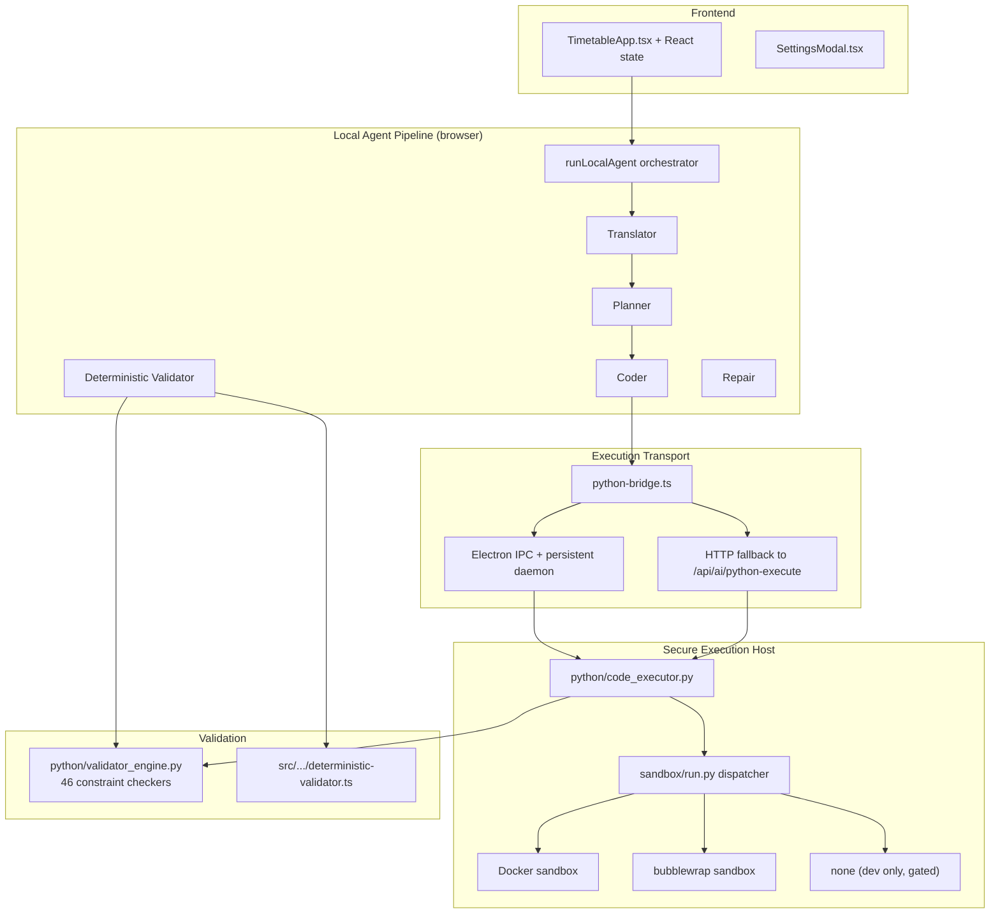

# Architecture

Active contributors: Duy

## Purpose

This page describes the end-to-end architecture of Tack Timetable: how user input flows through the 6-stage Local Agent, how generated solver code is executed safely, and how the desktop and web distributions share the same core while differing in execution transport. The design prioritizes **security** (LLM-generated code never runs on the host), **deterministic correctness** (validation + repair loop), and **observability** (typed lifecycle events at every stage).

## High-level layers



## Layer 1: Frontend / UI

- **Entry**: `src/app/page.tsx` renders the landing page with quick-import textarea and the button that mounts `TimetableApp`.
- **Main canvas**: `src/features/timetable/TimetableApp.tsx` (~3 kLOC) is a self-contained React application managing:
  - Days, sessions, period counts, deleted periods
  - Teacher / subject / class assignments with weekly period counts
  - Constraint entry (required / preferred natural language)
  - Live timetable grid, conflict highlighting, Excel export (via `xlsx`)
  - Provider settings (baseURL, apiKey, per-stage models)
  - Live agent progress via the typed `AgentLifecycleEvent` stream
- State is kept in React + Zustand; server state (provider tests) uses React Query.
- No global store beyond the agent result cache (last 3 successful runs persisted to localStorage).

## Layer 2: Local Agent Pipeline (6 stages)

All agent logic lives in `src/features/timetable/ai/`. The single public entry point is `runLocalAgent` in `local-agent.ts`.

**Stages (in order):**

1. **Translator** (`translator.ts`)
   - Input: raw `ConstraintItemInput[]` (natural language + required/preferred).
   - Output: `ConstraintSpec[]` (46 kinds, each with `kind`, `severity`, `params`).
   - Uses `prompts/translator.system.md`; falls back to rule-based parser for the newer constraint kinds.
   - Deduplicates specs by semantic signature before handing to Planner.

2. **Planner** (`planner.ts`)
   - Input: deduplicated `ConstraintSpec[]` + compressed `AgentInputPayload`.
   - Output: `Plan` (decision variables declaration, domain size estimate, constraint ordering, reification needs, objective choice, template names, risks).
   - Prompt: `prompts/planner.system.md`.

3. **Coder** (`coder.ts`)
   - Input: `Plan` + relevant `ConstraintSpec[]`.
   - Output: complete Python solver source that extends the solver skeleton.
   - Prompt: `prompts/coder.system.md`.
   - Before execution the code passes through `skeleton-injector.ts` (AST + syntax checks + constraint code injection).

4. **Sandbox execution** (via `python-bridge.ts`)
   - The bridge decides the transport:
     - If running inside Electron and the preload exposed `window.electron.python.executeCode` → uses native IPC.
     - Otherwise → POSTs to `/api/ai/python-execute` (server-side spawn of `code_executor.py`).
   - The bridge never executes Python itself.

5. **Deterministic Validator** (`deterministic-validator.ts` + `cp-sat-roundtrip.ts`)
   - After every execution the agent runs:
     - TypeScript-side `validateSchedule` (hard + soft constraint checkers mirrored from Python).
     - CP-SAT round-trip: re-encode the produced schedule as a solution and ask the solver whether it satisfies the same model.
   - Produces `DeterministicValidationReport` with `hardConstraintPass`, `softConstraintPass`, `hardCoverageComplete`, per-constraint `Violation[]`, and `iisConstraintIds`.

6. **Repair** (`repair.ts`)
   - If hard violations or round-trip failure exist and repair budget remains:
     - `MAX_RUNTIME_REPAIR_ROUNDS = 1`
     - `MAX_VIOLATION_REPAIR_ROUNDS = 2`
   - Calls `applyRepairPatches` then re-invokes Coder (with previous failure context) and Validator.
   - Only after the repair budget is exhausted or the schedule is clean does the agent return `LocalAgentFinalResult`.

**Orchestration guarantees** (hard-coded in `local-agent.ts`):
- `MAX_CODER_RETRIES = 3`
- `MAX_TOTAL_TOOL_CALLS = 15`
- `TOKEN_CAP_PER_RUN = 80_000`
- `StageCache` with 10-minute TTL to avoid repeating identical LLM calls inside one run.
- Every stage emits `stage_started` / `stage_completed` events plus typed progress phases (`thinking | translator | planner | coding | running | checking | fixing | idle`).

## Layer 3: Python Execution Host

**`python/code_executor.py`** (the only thing that ever executes solver code):

- Receives generated Python + `input.json` via a temp job directory.
- Writes the code to `solver_generated.py`, runs `py_compile` (catches syntax errors early).
- Calls `sandbox.run.run_sandboxed(...)` which dispatches according to `TT_SANDBOX_MODE` or auto-detect.
- Captures stdout/stderr, result.json, and structured status (`optimal | feasible | infeasible | timeout | crashed`).
- Enforces wall-clock timeout; returns a JSON envelope the TypeScript side understands.

**Sandbox dispatcher** (`sandbox/run.py`):

```text
TT_SANDBOX_MODE
  ├─ "docker" → sandbox/executor.py (run_in_sandbox)
  ├─ "bwrap"  → sandbox/bubblewrap_executor.py
  ├─ "none"   → raw subprocess (only if TT_SANDBOX_ALLOW_UNSAFE=1)
  └─ auto     → bwrap (Linux + present) > docker > error
```

- Docker path (`sandbox/executor.py`): builds `timetable-sandbox:latest` on first use, runs the solver with `--network=none`, read-only root, limited CPU/memory, and only the workspace directory mounted.
- Bubblewrap path (`sandbox/bubblewrap_executor.py`): new mount + PID namespace, seccomp filter, no network by default. Faster startup than Docker; still far safer than host execution.
- "none" mode is intentionally painful to enable and is only for local development.

**Persistent daemon (Electron only)**

In `electron/main.mjs` a long-lived `code_executor --daemon` process is kept alive. Jobs are sent over stdin as JSON lines; results come back on stdout. This eliminates Python startup cost for repeated solves inside one desktop session.

## Layer 4: Desktop vs Web distribution

- **Electron app** (`electron/main.mjs` + `preload.ts`):
  - Exposes `window.electron.python.executeCode` → talks to the bundled PyInstaller binary via the daemon.
  - Builds produce AppImage/deb (Linux) and NSIS/portable (Windows).
  - Python runner + skeleton + validator are bundled as extra resources.

- **Web / standalone Next.js**:
  - All execution goes through the server route `/api/ai/python-execute`.
  - The server spawns `python3 python/code_executor.py` in a job temp dir (still inside the same sandbox dispatcher).
  - Provider keys must be supplied by the browser (they travel only to the LLM proxy `/api/ai/chat`).

Both distributions share 100% of the TypeScript agent logic and the same Python host code.

## Layer 5: API surface (Next.js routes)

All routes live under `src/app/api/ai/` and `src/app/api/provider/`:

- `POST /api/ai/chat` — server-side LLM proxy. Supports OpenAI-compatible endpoints and Anthropic with prompt caching. Never logs API keys.
- `POST /api/ai/python-execute` — web fallback described above.
- `POST /api/ai/python-syntax-check`, `POST /api/ai/python-ast-check` — lightweight static checks used by the agent before expensive execution.
- `GET /api/ai/solver-skeleton` — serves the current `public/templates/solver_skeleton.py` (kept in sync with `python/templates/` by `scripts/sync_solver_template.mjs`).
- `POST /api/provider/test` — connectivity + model listing smoke for the configured provider.

These routes are intentionally narrow; they exist only to bridge the browser agent to external services or the sandboxed Python host.

## Data models (cross-cutting)

Core types are defined in two files and mirrored where necessary on the Python side:

- `src/features/timetable/ai/types.ts` — `AgentInputPayload`, `ExecutionResult`, `LocalAgentFinalResult`, `AIProviderConfig`, lifecycle events.
- `src/features/timetable/ai/constraint-spec.ts` — `ConstraintSpec`, `ConstraintKind` (46 values), `Plan`, `ScheduleEntry`, `Violation`, `DeterministicValidationReport`.

The solver skeleton and `validator_engine.py` consume the same conceptual structures via JSON.

## Security model (the non-negotiable rule)

**"The AI never runs its own generated code on the host machine."**

- All solver code produced by the Coder stage is written to a throw-away temp directory.
- It is executed only inside `code_executor.py` under one of the two supported sandboxes.
- The Electron binary is built with PyInstaller; the web path runs the same Python source inside the Next.js server container.
- Even in development, "none" mode requires an explicit unsafe flag.

This invariant is enforced at three boundaries:
1. `python-bridge.ts` — refuses to execute locally.
2. `code_executor.py` — always calls the sandbox dispatcher.
3. `sandbox/run.py` — makes unsafe execution deliberately hard to enable.

## Observability & debugging

- Every agent run emits a stream of `AgentEvent` objects via the `onEvent` callback. The UI renders them as a live step list.
- Python side writes structured JSON to stdout; the daemon and HTTP routes surface `stdout`/`stderr` inside `ExecutionResult`.
- Token usage is tracked per stage by `TokenBudgetGuard` and surfaced in diagnostics.
- The deterministic validator produces machine-readable violation lists with `constraintId`, `kind`, and offending entries — these are the primary signals for the Repair stage and for user-facing error messages.

## Build & prompt lifecycle

- `prompts/*.md` are the source of truth for AI behavior.
- Before `dev`, `build`, `test`, and `pretest` the project runs `npm run sync:prompts` which copies them into `public/prompts/`.
- The same mechanism keeps `public/templates/solver_skeleton.py` in sync with the Python-side template.
- Changing a prompt is treated as a behavioral change; the CI runs `npm run test:prompt` which validates that the four prompts still produce valid JSON for the current model set.

This architecture page is intentionally high-level. See the dedicated pages for each major subsystem:

- [AI Pipeline — the 6 stages](systems/ai-pipeline/index.md)
- [Python Execution System](systems/python-execution.md)
- [Validation System](systems/validation.md)
- [Constraint System (46 kinds)](features/constraint-system.md)
- [Scheduling Wizard UI](features/scheduling-wizard.md)
