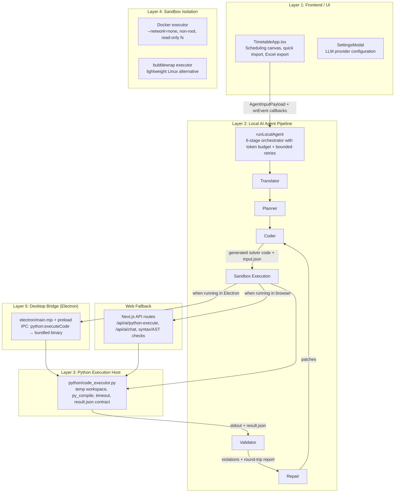
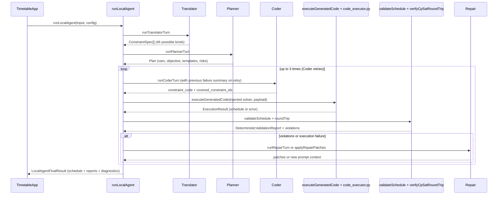

# Architecture

Active contributors: Duy

## Purpose

Tack Timetable is organized as five cooperating layers. The user interacts with a rich scheduling canvas in the browser. Behind the scenes, a six-stage Local Agent (Translator → Planner → Coder → Sandbox execution → Validator → Repair) turns natural-language and structured constraints into a validated timetable. Generated Python code is never executed on the host; it always runs inside an isolated sandbox (Docker preferred, bubblewrap as fallback). The Electron desktop app provides a native fast path to the same sandboxed executor.

The architecture deliberately separates "what the user wants" (the UI and constraint input) from "how it is computed safely" (the prompt-driven agent + sandbox + deterministic validation).

## High-level layers

## The six-stage Local Agent (the heart of the system)

The agent is implemented in `src/features/timetable/ai/local-agent.ts` as `runLocalAgent`. It is a stateful loop with hard safety limits:

- `MAX_CODER_RETRIES = 3`
- `MAX_RUNTIME_REPAIR_ROUNDS = 1`
- `MAX_VIOLATION_REPAIR_ROUNDS = 2`
- `MAX_TOTAL_TOOL_CALLS = 15`
- `TOKEN_CAP_PER_RUN = 80_000`

Every stage emits typed events through the `onEvent` callback so the UI can show progress, errors, and partial results.

Key supporting modules inside the agent:

- `workspace.ts` — `WorkspaceBoard` accumulates state (constraints, plan, latest code, attempt history) across stages.
- `budget-guard.ts` — `TokenBudgetGuard` enforces the 80k token cap using both reported usage and text estimation.
- `input-compressor.ts` — shrinks the payload sent to the LLM while preserving everything the stages need.
- `skeleton-injector.ts` — loads `python/templates/solver_skeleton.py`, injects the Coder's constraint code, and runs syntax + optional AST checks before execution.

## Python execution and the sandbox contract

The single source of truth for running untrusted solver code is `python/code_executor.py`.

It receives:
- A string of Python (the generated solver)
- An `input.json` (the `AgentInputPayload` plus warm-start schedule if available)

It performs:
1. Write code to a fresh temp directory.
2. `py_compile` (fast syntax gate).
3. Execute inside the chosen sandbox (Docker or bubblewrap) with a hard timeout.
4. Parse `result.json` written by the solver.
5. Return a structured `ExecutionResult` (phase, ok, status, schedule, stdout/stderr digest, etc.).

The sandbox layer (`sandbox/executor.py` and `sandbox/bubblewrap_executor.py`) guarantees:
- Network is disabled (`--network=none` for Docker).
- Filesystem is read-only except for the mounted workspace.
- Process runs as non-root.
- CPU and memory limits are applied.
- Timeouts are enforced at both the Docker/bwrap level and the Python level.

See `sandbox/README.md` for the production deployment recommendation (`TT_SANDBOX_MODE=docker` or `bwrap`).

## Electron vs web execution paths

There are two supported ways to reach the Python executor:

**Electron (recommended for performance and full isolation)**

- `electron/main.mjs` registers the `python:executeCode` IPC handler.
- It spawns the PyInstaller-bundled `code_executor` binary (or the dev `python-dist` version).
- The preload (`electron/preload.ts`) exposes `window.electron.python.executeCode`.
- `src/features/timetable/ai/python-bridge.ts` detects this path first and uses it.

**Browser / web fallback**

- When no Electron IPC is present, `python-bridge.ts` POSTs to `/api/ai/python-execute`.
- The route (`src/app/api/ai/python-execute/route.ts`) spawns `python3 python/code_executor.py` in a temp job directory with the same contract.
- This path is used during `npm run dev` and for hosted demos.

Both paths feed the exact same `code_executor.py` → sandbox → validator flow, so behavior is consistent.

## LLM integration (chat proxy)

The agent never calls LLM providers directly from the browser for security and caching reasons.

- All model calls go through `src/features/timetable/ai/chat-client.ts` → `invokeChat`.
- In the browser this hits the server route `POST /api/ai/chat`.
- The route (`src/app/api/ai/chat/route.ts`) supports OpenAI-compatible providers and adds Anthropic prompt-caching headers when the model starts with `anthropic/`.
- Provider credentials (baseURL + apiKey) are supplied at runtime from the Settings modal and are never persisted on disk by the app.

## Data model highlights

The key interfaces that cross layer boundaries live in `src/features/timetable/ai/types.ts` and `constraint-spec.ts`:

- `AgentInputPayload` — the normalized input the UI sends to the agent (days, sessions, assignments, raw constraints, metadata).
- `ConstraintSpec` + `ConstraintKind` (46 values) — the structured representation after translation. Each has `severity`, `params`, optional `weight`, `tags`, and (for `custom_dsl`) a `pythonPredicate`.
- `Plan` — the Planner's output (decision variables, estimated domain size, constraint ordering, objective, risks, templates used).
- `ExecutionResult` — what comes back from the executor (status, schedule, error digest, stdout/stderr).
- `LocalAgentFinalResult` — the final object returned to the UI, containing the schedule, two validation reports (deterministic + checker), violations, diagnostics, and attempt history.

## Security model (the non-negotiable rule)

**No code written by an LLM is ever executed with the privileges of the user who launched the app.**

This rule is enforced at three points:

1. The Coder stage only ever produces a fragment that is injected into the audited `solver_skeleton.py` template.
2. That combined file is syntax-checked, optionally AST-checked, then handed to `code_executor.py`.
3. `code_executor.py` always delegates to a sandbox (Docker or bubblewrap) before running the Python interpreter.

Even in development, the only way to bypass the sandbox is to explicitly set unsafe environment variables (documented in `sandbox/README.md`); the default is to refuse.

## Integration points and extension surfaces

- Adding a new built-in constraint kind: extend the `ConstraintKind` union in `constraint-spec.ts`, add a checker in `python/validator_engine.py`, update the Translator prompt and fallback parser in `translator.ts`, and add the corresponding TypeScript checker in `deterministic-validator.ts`.
- Changing agent behavior: edit the four prompt files in `prompts/`. They are the source of truth and are synced to `public/prompts/` by `scripts/sync_prompts.mjs` before every dev/build/test run.
- Improving the solver skeleton: edit `python/templates/solver_skeleton.py` (and its public copy). The Coder is explicitly told to complete the marked section.
- Changing execution isolation: modify `sandbox/executor.py` / `bubblewrap_executor.py` or the Docker image. The contract between `code_executor.py` and the sandbox is narrow (file path + timeout + workspace dir).
- Customizing the UI canvas: the bulk of the scheduling grid, assignment editing, and export logic lives in the single large component `src/features/timetable/TimetableApp.tsx`.

## Where to start if you need to change something

| Goal | Start here (full path) |
|------|------------------------|
| Understand the end-to-end flow | `src/features/timetable/ai/local-agent.ts` (especially `runLocalAgent`) |
| Add or modify a constraint kind | `src/features/timetable/ai/constraint-spec.ts` + `python/validator_engine.py` + `src/features/timetable/ai/deterministic-validator.ts` |
| Change how the LLM is prompted for a stage | `prompts/<stage>.system.md` |
| Debug why a schedule was rejected | `src/features/timetable/ai/deterministic-validator.ts` and `python/validator_engine.py` (the checkers are the ground truth) |
| Make execution faster or more isolated | `python/code_executor.py` + `sandbox/executor.py` (or bubblewrap) |
| Change the desktop experience | `electron/main.mjs` and `electron/preload.ts` |

All of the above should be preceded by a GitNexus impact analysis (`gitnexus_impact` or `gitnexus_context`) as required by the project guidelines in `AGENTS.md` and `CLAUDE.md`.
