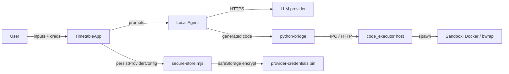

# Security

Active contributors: Duy

## Purpose

Tack Timetable runs LLM-generated solver code, ships a desktop app that talks to user-provided AI providers, and persists API credentials on disk. This page explains the trust boundaries the codebase enforces and the modules that implement them. Security work in this repo is concentrated in five areas: solver-code execution, secret storage, provider-URL validation, sandbox-mode policy, and AI cache integrity.

## Trust model

- Generated Python solver code is **never** executed on the host JS runtime or browser; it always traverses `python-bridge.ts` to a host (`code_executor.py`) which delegates to `sandbox/run.py` (Docker / bwrap / explicitly opted-in `none`).
- Provider API keys never leave the user's device except in outbound HTTPS calls to the configured base URL. They are not logged.
- The renderer never gets raw access to the on-disk credential file; it talks to `electron/secure-store.mjs` over a named IPC channel exposed by the preload script.

## Provider credential storage

The renderer used to base64-encode the provider config and write it to `localStorage`. As of the May 2026 update, credentials are persisted via Electron's [`safeStorage`](https://www.electronjs.org/docs/latest/api/safe-storage):

- Implementation: `electron/secure-store.mjs` (`saveProvider`, `loadProvider`, `clearProvider`, `isSecureStoreAvailable`).
- File: `userData/provider-credentials.bin`, written with mode `0o600`.
- Encryption: `safeStorage.encryptString` when an OS keychain is available; otherwise the file is prefixed with `PLAIN:` so the load path can detect a degraded blob and the renderer can show a "not encrypted" warning.
- Renderer surface: `provider-storage.ts` (`persistProviderConfig`, `loadProviderConfig`) calls into `window.electron.secureStore.*`. Falls back to the legacy localStorage blob if the IPC bridge is missing (web build) or the secure call fails.
- Migration: the legacy `tack_ai_provider_config` localStorage key is still readable on first launch; once `persistProviderConfig` writes the new file, the localStorage entry is removed.

`isSecureStoreAvailable()` is surfaced through `secureStore.isAvailable()` so the Settings UI can show a "stored without OS-level encryption" notice on Linux without libsecret. `TimetableApp.tsx` checks this on launch and surfaces a banner (`secureStorageNotice`) when either the bridge is missing or a legacy localStorage entry is still present, so the user is told before another save lands an unencrypted blob on disk.

## Provider URL validation

`src/app/api/provider/test/route.ts` is the only Next.js route that reaches out to a user-supplied URL. It validates the input before issuing any request:

- The URL must parse via the `URL` constructor (rejects relative or malformed strings).
- The protocol must be `http:` or `https:` (rejects `file:`, `javascript:`, `data:`, etc.).
- An `AbortController` aborts the request after 12 seconds so a hung provider cannot keep server resources allocated.
- Errors are mapped to user-friendly Vietnamese messages without echoing the URL or key back to the response body.

The same validation function feeds the Settings modal smoke test ("Test connection") and the agent's preflight check, so a bad URL is rejected at multiple layers.

## Sandbox production guard

`sandbox/run.py` exposes three execution backends: Docker (`run_in_sandbox`), bubblewrap (`run_with_bwrap`), and `none` (raw subprocess). The `none` backend is intentionally hard to enable:

- It runs only when **both** `TT_SANDBOX_BACKEND=none` and `TT_SANDBOX_ALLOW_UNSAFE=1` are set.
- A missing or mistyped variable raises a runtime error rather than silently downgrading to host execution.
- `python/tests/test_sandbox_production_guard.py` asserts this behavior in CI so a refactor cannot regress it.

In production, packaged builds default to `bundled` (PyInstaller binary) execution and rely on the runtime abstraction in `electron/solver-runtime.mjs` to pick Docker when explicitly requested.

## Static gates on generated code

Generated solver code passes through two static gates before the sandbox is ever spun up:

- **Syntax gate** (`check_syntax_only` in `python/code_executor.py`) — runs `py_compile` against the candidate code and rejects the output with a digested error if it fails to parse.
- **AST gate** (`check_ast_safety` in `python/code_executor.py`) — walks the AST and rejects:
  - any `import` / `from ... import ...` statement,
  - any call or attribute access in `FORBIDDEN_AST_NAMES` (`open`, `exec`, `eval`, `__import__`, `compile`, `input`, `breakpoint`, `globals`, `locals`, `vars`, `print`),
  - dunder access in `FORBIDDEN_AST_ATTRS` (`__import__`, `__builtins__`, `__class__`, `__bases__`, `__subclasses__`, `__mro__`),
  - loads of names that are not locally bound and not in `ALLOWED_AST_LOAD_NAMES` (the solver-template variables plus a fixed set of safe builtins).

In Electron the renderer drives these gates over IPC (`window.electron.python.syntaxCheck` / `astCheck`), so a malicious model output is caught without involving the Next.js server. The web build uses the equivalent `/api/ai/python-syntax-check` / `python-ast-check` routes.

## AI cache integrity

`src/features/timetable/ai/pipeline-versions.ts` is the single source of truth for prompt versions, solver-template version, and constraint-registry version. Every stage cache key (`stage-cache.ts`) folds these values in, so a prompt edit, a skeleton update, or a constraint registry bump invalidates stale cached responses across all users on next launch. This prevents an outdated cached planner output from corrupting a freshly-rebuilt pipeline.

`buildRunCacheDigest` in `src/features/timetable/ai/run-cache.ts` mirrors the same idea for the renderer's "last 3 successful runs" cache: the digest hashes the agent input, provider/model selection, and `PIPELINE_VERSIONS`, so any deployed prompt or template change forces a re-solve instead of replaying a stale schedule.

## Key source files

| File                                                  | Role                                                                  |
|-------------------------------------------------------|-----------------------------------------------------------------------|
| `electron/secure-store.mjs`                           | safeStorage-backed credential store with permission-restricted file writes. |
| `src/features/timetable/ai/provider-storage.ts`       | Renderer-side wrapper that prefers the secure bridge and falls back to localStorage. |
| `src/app/api/provider/test/route.ts`                  | Validates provider URLs and times out the smoke test.                 |
| `sandbox/run.py`                                      | Sandbox dispatcher with the production guard for the `none` backend.  |
| `python/tests/test_sandbox_production_guard.py`       | CI assertion that the unsafe sandbox cannot be enabled accidentally.  |
| `src/features/timetable/ai/pipeline-versions.ts`      | Prompt + template + registry versions used to invalidate stale caches. |

## Entry points for modification

- **Adding new credential fields** — extend `AIProviderConfig` in `types.ts`, update `provider-storage.ts` to round-trip the field, and confirm `secure-store.mjs` JSON-encodes the new shape.
- **Changing sandbox policy** — modify `sandbox/run.py` and update `test_sandbox_production_guard.py` so the new policy is asserted, not assumed.
- **Tightening provider URL validation** — touch `src/app/api/provider/test/route.ts`. Mirror any new check in the Settings UI test handler so users see the same error message.

See also: [Python Execution System](systems/python-execution.md) for the full sandbox dispatch layer and runtime mode abstraction.
