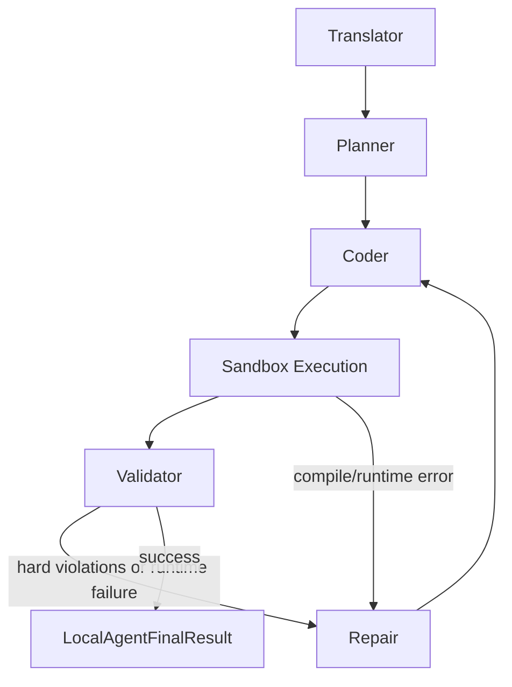
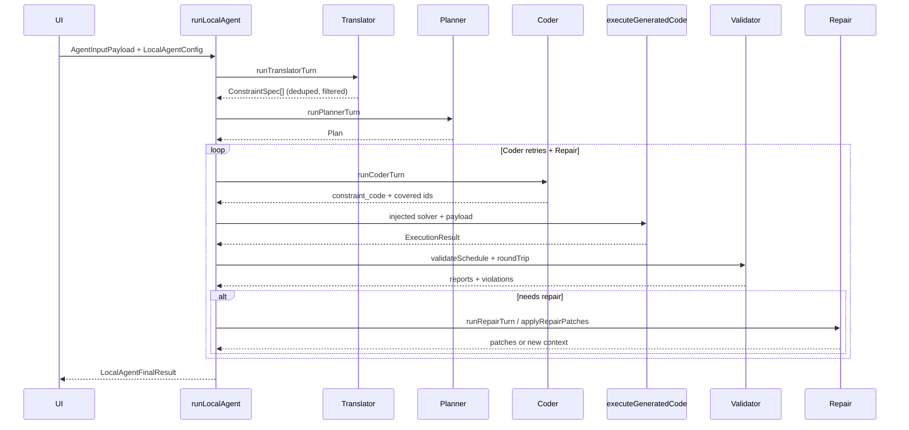

# AI Pipeline

Active contributors: Duy

## Purpose

The AI Pipeline is the central innovation of Tack Timetable. It is a six-stage, prompt-driven Local Agent that runs entirely in the browser (or inside the Electron renderer) and transforms a user's scheduling problem — expressed as assignments plus natural-language or structured constraints — into a validated, executable timetable.

The pipeline never executes code written by a language model with host privileges. Every generated solver fragment is injected into an audited skeleton, statically checked, and then run inside a sandbox (Docker or bubblewrap). After execution, a deterministic validator re-checks every constraint. Violations trigger a bounded repair loop.

The orchestrator is `runLocalAgent` in `src/features/timetable/ai/local-agent.ts`.

## The six stages



1. **Translator** — Raw constraint text + dataset context → list of structured `ConstraintSpec` objects (one of 46 `ConstraintKind` values). Combines LLM translation with deterministic fallback parser rules.
2. **Planner** — Produces a `Plan`: decision variable estimation, constraint ordering, reification needs, objective choice, template selection, and risks.
3. **Coder** — Given the plan and previous failure context, emits a Python constraint fragment that will be injected into the solver skeleton. Bounded by `MAX_CODER_RETRIES` (3).
4. **Sandbox Execution** — The generated solver (skeleton + injected code) is written to a temp workspace, syntax-checked, and executed inside Docker or bubblewrap via `python/code_executor.py`. Returns `ExecutionResult`.
5. **Validator** — Runs `validateSchedule` (TypeScript) + `verifyCpSatRoundTrip` + merges any `customChecks` from the sandbox. Produces two `DeterministicValidationReport`s (deterministic + checker) and a list of hard/soft violations.
6. **Repair** — When the validator finds hard violations or the executor reports a failure, the repair stage generates patches or new context and feeds them back to the Coder. Bounded by two separate round limits (`MAX_RUNTIME_REPAIR_ROUNDS=1`, `MAX_VIOLATION_REPAIR_ROUNDS=2`).

## Hard safety limits

The entire run is guarded by multiple caps (defined at the top of `local-agent.ts`):

```ts
const MAX_CODER_RETRIES = 3;
const MAX_RUNTIME_REPAIR_ROUNDS = 1;
const MAX_VIOLATION_REPAIR_ROUNDS = 2;
const MAX_TOTAL_TOOL_CALLS = 15;
const TOKEN_CAP_PER_RUN = 80_000;
```

If any limit is hit, the agent throws a clear error and returns the accumulated diagnostics and attempt history.

## Typed event stream

Every significant transition emits an `AgentEvent` through the `onEvent` callback in `LocalAgentConfig`. The UI (`TimetableApp.tsx`) renders these as a live progress panel with phases such as `thinking`, `translator`, `planner`, `coding`, `running`, `checking`, `fixing`, and `idle`.

Events include:
- `status`, `phase`
- `stage_started` / `stage_completed` (with attempt number)
- `violations_found`
- `execution_result`
- `final_result`
- `error`

This observability is critical for debugging why a particular timetable could or could not be produced.

## Supporting abstractions

- `WorkspaceBoard` (`workspace.ts`) — accumulates all intermediate state (constraint specs, compressed dataset, plan, latest code, attempt history) so later stages and diagnostics can see the full trace.
- `TokenBudgetGuard` (`budget-guard.ts`) — enforces the 80k token cap using either reported usage or text estimation fallback.
- `input-compressor.ts` — shrinks the payload sent to the LLM while preserving everything the stages need (dataset digest, assignments, constraints).
- `skeleton-injector.ts` — loads the current solver skeleton, injects the Coder's fragment at the marked point, and runs syntax + optional AST checks before execution.

## Data flow at a glance



## Why this architecture?

The design solves several hard problems simultaneously:

- **Safety**: LLM-generated code never runs on the host.
- **Reliability**: The solver is never trusted. Deterministic validation + round-trip checks + bounded repair catch both model and solver mistakes.
- **Observability**: Typed events + `WorkspaceBoard` + attempt history make it possible to explain *why* a timetable succeeded or failed.
- **Extensibility**: Adding a new `ConstraintKind` requires changes in a small number of well-defined places (type, translator prompt + fallback, Python checker, TypeScript checker) without touching the orchestrator.
- **Cost control**: The token budget and retry limits prevent runaway spend even when the model is struggling.

## Related pages

- [Translator Stage](translator.md)
- [Planner Stage](planner.md)
- [Coder Stage](coder.md)
- [Validation Stage](validator.md)
- [Repair Stage](repair.md)
- [Python Execution](../python-execution.md)
- [Validation System](../validation.md)
- [Constraint System](../../features/constraint-system.md)
- [Architecture](../../overview/architecture.md) (the five-layer system view)
- [Patterns and Conventions](../../../how-to-contribute/patterns-and-conventions.md) (bounded loops, typed events, never trust the solver)

## Where to start if you need to change the pipeline

1. Read `src/features/timetable/ai/local-agent.ts` end-to-end (especially `runLocalAgent` and the two repair loops).
2. Run `gitnexus_impact` on the symbol you intend to touch.
3. Update the corresponding stage prompt (in `prompts/`) if behavior must change.
4. Add or update tests (unit tests + `npm run test:prompt` for prompt-sensitive changes).
5. Verify that all typed events and `WorkspaceBoard` updates remain consistent so the UI and diagnostics continue to work.
