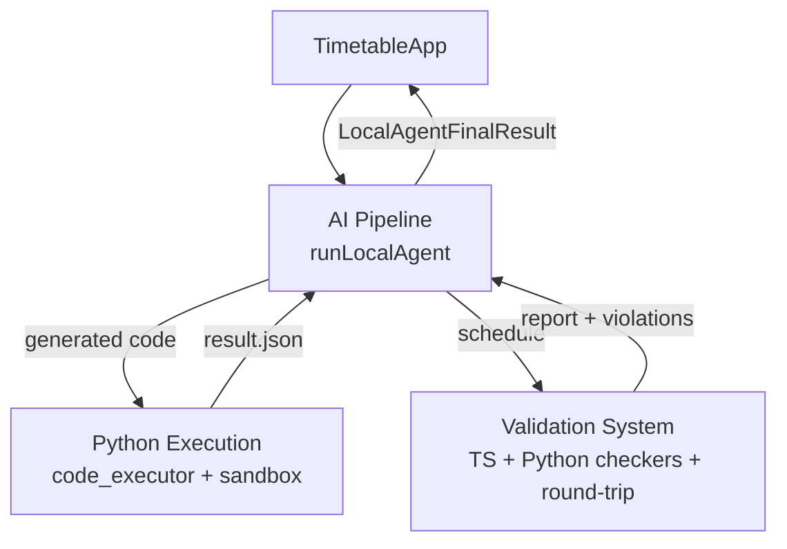

# Systems

Active contributors: Duy

## Purpose

Systems are the internal architectural building blocks that power the product but do not map 1:1 to a single user-facing feature. They are the reusable machinery that multiple features depend on.

In Tack Timetable the primary systems are:

- The **AI Pipeline** — the 6-stage Local Agent that turns natural-language constraints into validated solver code.
- The **Python Execution System** — the secure host and sandbox dispatcher that is the only thing allowed to run LLM-generated code.
- The **Validation System** — the deterministic (non-LLM) checker layer that makes the "AI writes solvers" approach trustworthy.

These three systems together implement the central value proposition of the product.

## Directory layout

```
src/features/timetable/ai/          # Entire AI Pipeline (orchestrator + 6 stages)
python/
  code_executor.py                  # Secure execution host
  validator_engine.py               # 46 (currently 35 implemented) constraint checkers
  templates/solver_skeleton.py
sandbox/
  run.py                            # Dispatcher (docker / bwrap / none)
  executor.py                       # Docker sandbox
  bubblewrap_executor.py
electron/main.mjs                   # Persistent Python daemon for desktop
src/app/api/ai/                     # Server-side fallbacks (python-execute, chat proxy, checks)
```

## Key subsystems

| System                        | Primary files                                                                 | Responsibility |
|-------------------------------|---------------------------------------------------------------------------------|----------------|
| AI Pipeline                   | `src/features/timetable/ai/local-agent.ts` + stage files                        | 6-stage reasoning loop with bounded retries, caching, token budgeting, and typed events |
| Python Execution              | `python/code_executor.py`, `sandbox/run.py`, `electron/main.mjs`                | Only place LLM-generated solver code is ever executed; sandbox dispatch + daemon |
| Validation                    | `python/validator_engine.py`, `src/features/timetable/ai/deterministic-validator.ts` | Deterministic hard/soft checking + CP-SAT round-trip for every execution result |
| Constraint Registry (emerging)| `src/features/timetable/ai/constraint-registry.ts`                              | Central list of implemented checkers and metadata (used by validator and UI) |

## How the systems relate



The AI Pipeline is the conductor. Python Execution and Validation are the two critical engines it calls on every iteration.

## Integration with features

- The **Scheduling Wizard** (user-facing) drives the AI Pipeline via `runLocalAgent`.
- The **Constraint System** (domain model) is interpreted by the AI Pipeline and enforced by the Validation System.
- All three systems are deliberately isolated from UI concerns so they can be tested, reasoned about, and evolved independently.

See the individual system pages for deep dives:

- [AI Pipeline](ai-pipeline/index.md) (with sub-pages for each stage)
- [Python Execution System](python-execution.md)
- [Validation System](validation.md)

## Entry points for modification

- Adding a new reasoning stage → extend the orchestrator in `local-agent.ts` and emit the corresponding lifecycle events.
- Strengthening the sandbox → modify `sandbox/run.py` or the chosen executor; never bypass the dispatcher.
- Adding a new deterministic checker → implement in both `python/validator_engine.py` and the TypeScript side, then register it so `hardCoverageComplete` remains accurate.

All changes to these systems should be preceded by GitNexus impact analysis (see [Patterns and conventions](../how-to-contribute/patterns-and-conventions.md)).
