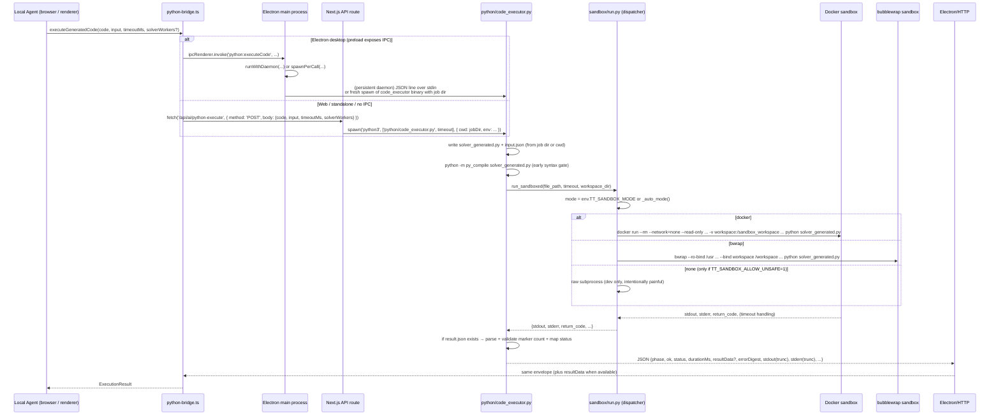

# Python Execution System

Active contributors: Duy

## Purpose

The Python Execution System is the **only** component in the Tack Timetable repository that is ever allowed to execute solver code generated by the LLM Coder stage. It is implemented as a hardened sandbox host (`python/code_executor.py`) that:

- Receives generated Python source + `input.json` via a throw-away job directory.
- Performs an early `py_compile` syntax gate.
- Dispatches execution through `sandbox/run.py` to a strongly isolated runtime (Docker recommended; bubblewrap fallback; gated "none" mode for development only).
- Enforces a strict `result.json` contract plus single `SOLUTION_FOUND` marker rule.
- Captures structured status (`optimal | feasible | infeasible | timeout | crashed`), artifacts under `.ai_results/`, and truncated stdout/stderr.
- Returns a typed `ExecutionResult` envelope understood by the TypeScript agent.

**Non-negotiable security rule**: LLM-generated solver code is **never** executed directly on the host machine. The bridge (`python-bridge.ts`) explicitly refuses local execution and always routes through the host. The host always delegates to the sandbox dispatcher.

See also:
- [overview/architecture.md](../overview/architecture.md) (security model and layer diagram)
- [systems/ai-pipeline/coder.md](../ai-pipeline/coder.md)
- [systems/ai-pipeline/index.md](../ai-pipeline/index.md)

## Directory layout

Only the files and directories relevant to secure Python execution are listed (paths are repo-root relative):

- `python/`
  - `code_executor.py` — the single secure host entry point (`run_user_code`, `daemon`, `main`, py_compile gate, `result.json` parsing, status mapping, artifact rotation).
  - `templates/solver_skeleton.py` — authoritative CP-SAT solver skeleton that generated code must extend (synced at build time to `public/templates/`).
  - `validator_engine.py` — 46 constraint checkers (used by the deterministic validator after execution).
- `sandbox/`
  - `run.py` — dispatcher (`run_sandboxed`) that chooses the isolation technology based on `TT_SANDBOX_MODE` env or auto-detect (`docker` > `bwrap` > error; `none` only if `TT_SANDBOX_ALLOW_UNSAFE=1`).
  - `executor.py` — Docker sandbox implementation (`run_in_sandbox`, `ensure_image_built`, strict hardening: `--network=none`, read-only root, tmpfs, non-root user, capability drops, CPU/memory limits, workspace-only mount).
  - `bubblewrap_executor.py` — lightweight Linux namespace sandbox (`run_with_bubblewrap`: new mount/PID namespaces, seccomp, bind only workspace + Python site-packages).
  - `Dockerfile` — minimal Python 3.11-slim + ortools image used by the Docker sandbox.
  - `README.md` — historical context and operational guidance for sandbox choices.
- `electron/`
  - `main.mjs` — persistent daemon lifecycle (`spawnDaemon`, `ensureDaemon`, `runWithDaemon`), per-call fallback (`spawnPerCall`), job directory creation with `input.json`, `python:executeCode` IPC handler.
  - `preload.ts` — contextBridge exposure of `window.electron.python.executeCode`.
- `src/features/timetable/ai/`
  - `python-bridge.ts` — high-level transport selector used by the Local Agent (`executeGeneratedCode`). Chooses Electron IPC (when preload exposes it) or HTTP POST fallback.
- `src/app/api/ai/python-execute/`
  - `route.ts` — Next.js server route (web / standalone distribution). Creates a unique job temp dir, spawns `python3 python/code_executor.py`, enforces path safety on `resultPath`, supports partial result on timeout, performs tree kill on timeout.

## Key abstractions

| Abstraction                | Primary File(s)                                      | Responsibility |
|----------------------------|------------------------------------------------------|--------------|
| `run_user_code`            | `python/code_executor.py`                            | Create temp workspace, copy or create `input.json`, write `solver_generated.py`, run `py_compile`, invoke `sandbox/run.py:run_sandboxed`, enforce single `SOLUTION_FOUND` marker, parse `result.json`, map raw status, write capped `.ai_results/` artifact, return structured envelope (`phase`, `ok`, `status`, `durationMs`, `resultSummary`, `errorDigest`, `stdout`, `stderr`, optional `resultPath`/`resultData`). |
| `daemon`                   | `python/code_executor.py`                            | Persistent newline-JSON worker mode (read jobs from stdin, write results to stdout). Used by Electron desktop for low-latency repeated solves within one session. Respects per-job `solverWorkers` override. |
| `run_sandboxed`            | `sandbox/run.py`                                     | Auto-detect (`_auto_mode`) or env-selected dispatch (`TT_SANDBOX_MODE`) to Docker, bwrap, or (unsafe) raw subprocess. Always annotates result with `sandbox` field. |
| `run_in_sandbox`           | `sandbox/executor.py`                                | Build (if needed) and run the Docker image with maximum hardening. Image tag defaults to `tack-timetable-solver:latest` and can be overridden via `TT_DOCKER_IMAGE`. Enforces workspace-only visibility, no network, resource limits, non-root execution. |
| `run_with_bubblewrap`      | `sandbox/bubblewrap_executor.py`                     | Execute via `bwrap` with new mount/PID namespaces, seccomp filter, minimal bind mounts (workspace + Python packages only). Faster startup than Docker; Linux-only. |
| `executeGeneratedCode`     | `src/features/timetable/ai/python-bridge.ts`         | Public API called by the 6-stage Local Agent. Detects Electron vs web context and routes accordingly. Never executes Python itself. |
| `python:executeCode` IPC   | `electron/main.mjs` + `preload.ts`                   | Desktop transport surface. Manages the long-lived daemon worker or falls back to per-call spawn. Writes `input.json` to a temp job dir before invoking the binary. |
| `POST /api/ai/python-execute` | `src/app/api/ai/python-execute/route.ts`          | Web/standalone transport. Creates isolated job temp dir, spawns the executor with strict env and timeout handling, validates `resultPath` to prevent traversal, supports best-effort partial result on timeout. |

## How it works

Two distinct transports feed the same hardened host:

Key runtime behaviors:
- The generated solver is expected to read `input.json` and write `result.json` with at minimum `{ "status": "...", "schedule": [...] }`.
- The host enforces that `SOLUTION_FOUND` appears at most once in stdout.
- On timeout the host (and web route) attempt best-effort partial result extraction.
- Artifacts are rotated (max 50) under `.ai_results/`.

## Integration points

- **Local Agent pipeline** — `src/features/timetable/ai/local-agent.ts` (and the Coder/Repair stages) calls `executeGeneratedCode`. Failures surface as typed `ExecutionResult` with `status` and `errorDigest`. See [systems/ai-pipeline/coder.md](../ai-pipeline/coder.md).
- **Architecture** — The security model ("AI never runs its own code on the host") and the five-layer diagram are described in [overview/architecture.md](../overview/architecture.md).
- **Full AI pipeline context** — The 6-stage loop (Translator → Planner → Coder → Sandbox execution → Deterministic Validator → Repair) is documented in [systems/ai-pipeline/index.md](../ai-pipeline/index.md).
- **Solver skeleton & validation** — Generated code must conform to `python/templates/solver_skeleton.py`. Post-execution validation uses both `validator_engine.py` (Python) and `deterministic-validator.ts` (TypeScript) + CP-SAT round-trip.
- **Build / packaging** — The Electron builder bundles the PyInstaller `code_executor` binary (from `python-dist/`) plus Python source fallback. The same `code_executor.py` source is used by the web server route. The renderer can switch between bundled / Docker / system Python via `window.electron.solverRuntime.setMode`; the resolver lives in `electron/solver-runtime.mjs`.

## Runtime mode abstraction (Electron)

`electron/solver-runtime.mjs` is a small pure-function module that decides how to spawn the executor for the current job. The renderer chooses one of three modes via the secure-stored `AIProviderConfig.solverRuntimeMode`:

| Mode      | Spawn target                                                  | When it is useful                                       |
|-----------|--------------------------------------------------------------|--------------------------------------------------------|
| `bundled` | PyInstaller binary at `python-dist/<platform>/code_executor` | Default. No system Python, ships with the app.        |
| `docker`  | `docker run --rm tack-timetable-solver:latest`                | Hardest isolation. Requires Docker engine running. Image tag is overridable via `TT_DOCKER_IMAGE`. |
| `system`  | `python3 python/code_executor.py`                              | Developer mode (the source is on disk and editable).  |

`resolveSpawnSpec` returns a `{ command, args, env, fallbackReason? }` object. When `mode === 'docker'` but the live Docker probe (`electron/docker-check.mjs`) reports `usable === false`, the resolver silently falls back to bundled and emits a one-time `solver-runtime:notice` IPC event to the renderer (`AGENT_NOTICE` in the UI) so the user knows what actually ran.

The probe runs `docker info` once per app session, caches the result, and surfaces a localized fallback message via `dockerFallbackMessage(reason)` if Docker is selected but unreachable. Selecting `bundled` or `system` skips the probe entirely.

## Production guard for unsafe sandbox

`sandbox/run.py` will refuse the `none` (raw subprocess) mode unless **both** `TT_SANDBOX_BACKEND=none` and `TT_SANDBOX_ALLOW_UNSAFE=1` are set. `python/tests/test_sandbox_production_guard.py` asserts this guard so a missing env var fails CI rather than silently downgrading to host execution.

`scripts/post-build.mjs` runs after every Next build and now exits non-zero (instead of just warning) when the bundled `code_executor` binary is missing from `python-dist/<platform>/`. This blocks accidental release builds that would later fall back to host Python at solve time.

## In-process syntax and AST gates

`code_executor.py` exposes two static pre-gates that run inside the same sandboxed runtime as solver execution:

- `check_syntax_only(code)` — writes the candidate code to a temp file and runs `py_compile` to surface compile errors before any sandbox spin-up.
- `check_ast_safety(code)` — parses the code, walks the AST, and rejects:
  - Any `import` / `from ... import ...` statement (the solver template provides everything the model is allowed to use).
  - Calls or attribute access matching `FORBIDDEN_AST_NAMES` (`open`, `exec`, `eval`, `__import__`, `compile`, `input`, `breakpoint`, `globals`, `locals`, `vars`, `print`).
  - Dunder access listed in `FORBIDDEN_AST_ATTRS` (`__import__`, `__builtins__`, `__class__`, `__bases__`, `__subclasses__`, `__mro__`).
  - Loads of names that are not locally bound and not in `ALLOWED_AST_LOAD_NAMES`. The allowlist contains the solver-template variables (`model`, `slots`, `data`, `assignments`, `days`, `periods`, `periods_by_day`, `constraints`, `custom_specs`, `schedule`) plus a fixed set of safe builtins.

These gates are invoked via two transports:

- **Electron**: `electron/preload.ts` exposes `window.electron.python.syntaxCheck` and `window.electron.python.astCheck`. The renderer's `src/features/timetable/ai/skeleton-injector.ts` prefers this bridge over HTTP. `electron/main.mjs` dispatches the request through `runExecutorCheck` which talks to the existing daemon (using a `type: 'syntax-check' | 'ast-check'` discriminator) or falls back to a one-shot `code_executor --syntax-check` / `--ast-check` spawn. No Next.js server needed.
- **Web**: same `skeleton-injector.ts` falls back to `/api/ai/python-syntax-check` and `/api/ai/python-ast-check`, which spawn `python3 python/code_executor.py` with the same flags.

Both gates run before the agent ever asks the sandbox to execute the generated solver, so the failure cost is one `py_compile` + one AST walk rather than a full Docker / bwrap startup.

## Entry points for modification

- **Add or change sandbox technology** — Extend the dispatch table in `sandbox/run.py`. Implement a new executor following the existing result shape contract. Update auto-detect logic and `sandbox/README.md`.
- **Modify the result contract or status mapping** — Edit `run_user_code` (and the TypeScript `ExecutionResult` / `types.ts` definitions). All callers, tests, and prompt expectations must be updated.
- **Adjust timeouts, parallelism, or resource limits** — `EXECUTOR_TIMEOUT_SECONDS` (env/argv), `SOLVER_WORKERS`, Docker `--memory`/`--cpus`, or bwrap limits. Exposed to the UI via bridge options.
- **Harden or evolve the Electron daemon** — Changes to `spawnDaemon`, `runWithDaemon`, or the IPC handler in `electron/main.mjs`. Must preserve the fallback to per-call spawn.
- **Web route safety changes** — Any modification to job directory handling, `resultPath` validation, tree-kill logic, or partial-result-on-timeout behavior in `src/app/api/ai/python-execute/route.ts` must preserve the documented isolation and traversal-prevention properties.
- **Prompt or skeleton changes that affect generated code shape** — Coordinate with the Coder stage ([systems/ai-pipeline/coder.md](../ai-pipeline/coder.md)) and run the prompt validation suite (`npm run test:prompt`).

## Key source files

All code references below use full repo-root paths.

| Path                                                      | Approx. LOC | Role |
|-----------------------------------------------------------|-------------|------|
| `python/code_executor.py`                                 | ~350        | The sole secure host that executes LLM-generated solver code. Implements `run_user_code`, `daemon` mode, py_compile gate, `result.json` contract, artifacting, and status mapping. |
| `sandbox/run.py`                                          | ~130        | Sandbox dispatcher. Selects Docker, bubblewrap, or (unsafe) raw mode. Auto-detects when `TT_SANDBOX_MODE` is unset. |
| `sandbox/executor.py`                                     | ~300        | Docker sandbox implementation. Builds the configured image (`TT_DOCKER_IMAGE`, default `tack-timetable-solver:latest`) on demand. Enforces `--network=none`, read-only root, non-root user, capability drops, resource limits, workspace-only mount. |
| `sandbox/bubblewrap_executor.py`                          | ~150        | Lightweight Linux bwrap sandbox. New mount + PID namespaces + seccomp. Binds only workspace and Python package roots. |
| `sandbox/Dockerfile`                                      | ~40         | Minimal hardened image (python:3.11-slim + ortools) used by the Docker sandbox path. |
| `sandbox/README.md`                                       | ~200        | Historical motivation and operational guidance for the sandboxing strategy. |
| `electron/main.mjs`                                       | ~280        | Electron main process. Manages persistent `code_executor --daemon` worker, job directory creation, IPC handler for `python:executeCode`, and per-call fallback spawn. |
| `electron/preload.ts`                                     | ~10         | Exposes the Python execution IPC surface to the renderer via contextBridge. |
| `src/features/timetable/ai/python-bridge.ts`              | ~60         | High-level bridge used by the Local Agent. Chooses between Electron IPC and HTTP fallback. |
| `src/app/api/ai/python-execute/route.ts`                  | ~200        | Next.js API route used by web/standalone distributions. Creates isolated job dirs, spawns the executor, enforces path safety, and supports partial results on timeout. |

No other files in the repository are permitted to execute or spawn interpreters for LLM-generated solver code. All execution funnels through the files listed above.
