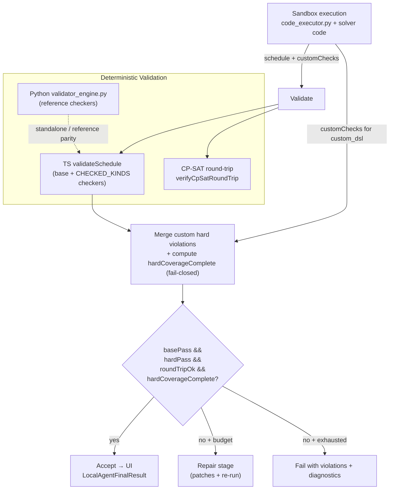

# Validation System

Active contributors: Duy

## Overview

After every solver execution the system runs deterministic (non-LLM) validation in both TypeScript and Python. The Python side (`python/validator_engine.py`) implements checkers for ConstraintKind values and is used both inside the agent loop (via sandbox-reported custom predicate results) and for standalone verification. The TypeScript side (`deterministic-validator.ts` + `cp-sat-roundtrip.ts`) mirrors the important checkers, adds newer kinds, and always performs a CP-SAT round-trip feasibility re-check. Together they make the "AI writes solver code" approach trustworthy: no schedule reaches the UI unless it passes base constraints, hard constraint checks, round-trip verification, and hard-coverage completeness.

The validation layer is the primary reason the 6-stage Local Agent can safely surface LLM-generated solver code to users.

## Validation Data Flow



## Python Validator Engine (`validator_engine.py`)

`python/validator_engine.py` is the reference implementation of deterministic constraint checking. It is imported by `code_executor.py` (for custom predicate execution inside generated solvers) and by `python/tests/test_validator_engine.py`.

### Core entry point

```python
def validate_schedule(
    schedule: list[dict],
    constraint_specs: list[dict],
    assignments: list[dict] | None = None,
) -> dict:
```

Returns:
- `ok`: true only if no violations at all
- `baseConstraintPass`, `hardConstraintPass`, `softConstraintPass`
- `violations`, `hardViolations`, `softViolations`
- `uncheckedConstraintIds`

### Base checks (always-on, independent of ConstraintKind)

- Teacher clash at same (day, period)
- Class clash at same (day, period)
- Weekly periods exact match against the declared assignments (for each assignment id)

Implemented in `_base_checks`.

### Kind-specific checkers (`_check_single`)

The engine implements explicit checkers for these ConstraintKind values (plus the base checks above):

- `teacher_block_day`, `teacher_block_period`, `teacher_block_slot`
- `teacher_max_per_day`, `teacher_max_consecutive`
- `subject_pin_period`, `subject_consecutive`
- `class_no_double_subject_day`
- `weekly_periods_exact`
- `pair_not_same_slot`
- `if_then` (with nested condition evaluation and then-actions)
- `session_limit`
- `subject_group_daily_limit`

Special handling:
- `resource_capacity`: explicitly skipped (capacity is enforced inside the CP-SAT model by the generated solver, not re-checked post-hoc).
- `custom_dsl`: marked as unchecked here; the actual predicate runs inside the generated solver and results are reported back via the `customChecks` array in the execution result.

All other kinds fall through to `[]` (no violation) in the current Python engine; the TypeScript gate (driven by the registry) is the primary checker for newer kinds.

### Condition evaluation support

`_evaluate_condition` supports the small expression language used by `if_then`:
- `teacher_teaches_on_day`, `teacher_teaches_at_slot`
- `and` / `or` / `not` combinators

## TypeScript Deterministic Validator

`src/features/timetable/ai/deterministic-validator.ts` implements the fast, in-process gate used on every agent run. It is driven by `CHECKED_KINDS` from the constraint registry.

### What it covers

- Full mirror of the core checkers present in Python (for parity on the original set).
- Additional checkers for the expanded set (the ~17 newer kinds added 2026-05), including:
  - All `teacher_*` (max working days, min per day, no gaps, allowed days/periods, ...)
  - All `subject_*` extensions (max consecutive, allowed days, min gap days, daily max periods, ...)
  - All `class_block_*`, `class_max/min_per_day`, `class_no_gaps`, `class_subjects_not_same_day`
  - All `assignment_*` (pin slot, block slot, allowed slots, spread days)
  - `weekly_periods_exact` (with `auto_base` tag skip)
  - `subject_group_daily_limit`, `session_limit`, `pair_not_same_slot`, `if_then`, etc.

### Fail-closed coverage

- `hardCoverageComplete`: false if any hard constraint has a kind without a checker (or is `custom_dsl` not covered by sandbox customChecks). This prevents "we don't know, so it must be ok".
- `uncheckedConstraintIds` and `hardUncheckedConstraintIds` are surfaced for repair guidance.

### CP-SAT round-trip

`src/features/timetable/ai/cp-sat-roundtrip.ts` (`verifyCpSatRoundTrip`):
- Re-encodes the produced schedule as a forced solution in a fresh CP-SAT model (using the same assignments + domain).
- Asks the solver: "Is this still feasible?"
- Catches cases where the generated solver code silently dropped constraints or produced an invalid schedule that only appeared to satisfy the model.

## Integration in the Agent Loop (call sites)

Primary consumer: `src/features/timetable/ai/local-agent.ts` (`runLocalAgent`).

After every successful solver execution (inside the coder retry loop):

1. Post-process schedule to attach `assignmentId` where unambiguous.
2. Call `validateSchedule(scheduleWithAssignmentIds, deduped, { assignments })`.
3. Call `verifyCpSatRoundTrip(...)`.
4. Merge `customChecks` (from sandbox `resultData`) for `custom_dsl` predicates that were actually executed inside the generated solver.
5. Compute `allHardViolations` and `hardUncheckedIds` (excluding those covered by customChecks).
6. Accept only if:
   - `baseConstraintPass`
   - `allHardViolations.length === 0`
   - `roundTrip.ok`
   - `hardUncheckedIds.length === 0`
7. Otherwise, feed hard violations (plus pseudo-violations for uncovered hard constraints) into the Repair stage (bounded: 1 runtime repair round, 2 violation repair rounds total).

The validator is also what populates `deterministicReport` / `checkerReport` / `violations` on successful `LocalAgentFinalResult`.

## Standalone Verification and Testing

- `python/tests/test_validator_engine.py` — pytest tests for core behaviors (subject_consecutive remainder rule, class_no_double custom maxPerDay, ignore resource_capacity + check supported limits).
- The engine can be imported directly for external scripts or debugging of constraint semantics without running the full agent.

## Key Source Files

| Full Path                                              | Role / Responsibility |
|--------------------------------------------------------|-----------------------|
| `python/validator_engine.py`                           | Reference Python implementation of base checks + kind-specific checkers for core ConstraintKind values. Used inside sandboxes for custom_dsl predicates and for standalone verification. |
| `python/tests/test_validator_engine.py`                | Pytest unit tests exercising the Python engine's checker logic and special-case handling. |
| `src/features/timetable/ai/deterministic-validator.ts` | TypeScript gate used on every agent run. Mirrors core checkers, implements newer kinds, enforces hardCoverageComplete (fail-closed), and produces DeterministicValidationReport. |
| `src/features/timetable/ai/cp-sat-roundtrip.ts`        | CP-SAT round-trip feasibility verifier. Re-encodes produced schedule as forced solution and confirms the solver still accepts it. |
| `src/features/timetable/ai/constraint-spec.ts`         | Canonical types: `ConstraintKind` union (the 46 kinds), `ConstraintSpec`, `ScheduleEntry`, `Violation`, `DeterministicValidationReport`, `ConditionExpr`. |
| `src/features/timetable/ai/constraint-registry.ts`     | `CONSTRAINT_REGISTRY` (36 meta entries), `CHECKED_KINDS` set (drives which kinds get deterministic checkers in TS), `getConstraintMeta`. |
| `src/features/timetable/ai/local-agent.ts`             | All validation call sites, customChecks merge, hard-violation decision logic, repair loop integration, and `hardCoverageComplete` gate before accepting a result. |

## Related Pages

- [Validation Stage (AI Pipeline)](systems/ai-pipeline/validator.md) — the 5th stage inside the 6-stage Local Agent loop; how violations drive the Repair stage.
- [Constraint System](features/constraint-system.md) — complete enumeration and semantics of all 46 ConstraintKind values.
- [AI Pipeline](systems/ai-pipeline/index.md) — the full 6-stage orchestrator and bounded retry/repair policy.
- [Architecture](overview/architecture.md) — where validation sits in the layered security and correctness model.
- [Glossary](overview/glossary.md) — definitions of DeterministicValidationReport, Round-trip check, hardCoverageComplete, etc.

## Notes on 46 vs. Current Registry

Documentation and commit history refer to "46 ConstraintKind values" after the May 2026 expansion (17 new built-in kinds). The TypeScript registry + union is the current source of truth for the declared set; the Python engine provides deep coverage for the original/core subset plus the shared base checks, while the TypeScript validator (plus sandbox custom predicate execution) provides the complete fast gate for the full declared set. When adding a new kind, the pattern is: extend the union + registry, implement the checker in both layers (or explicitly mark hasChecker:false + handle via code gen), and update translator fallback rules.
